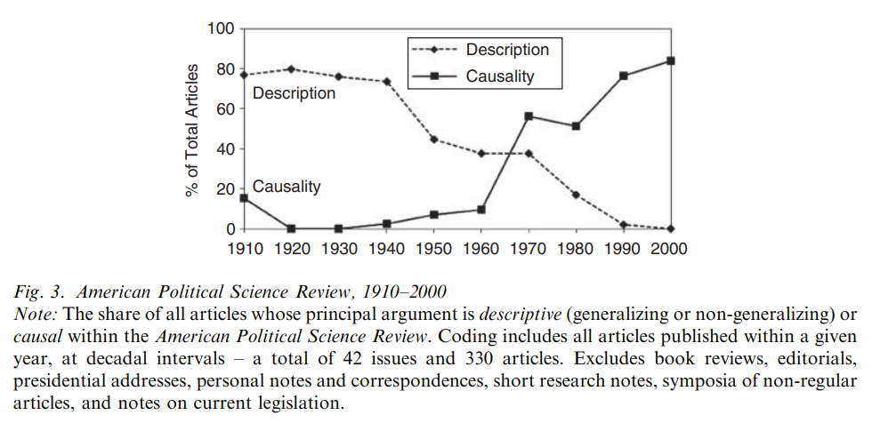
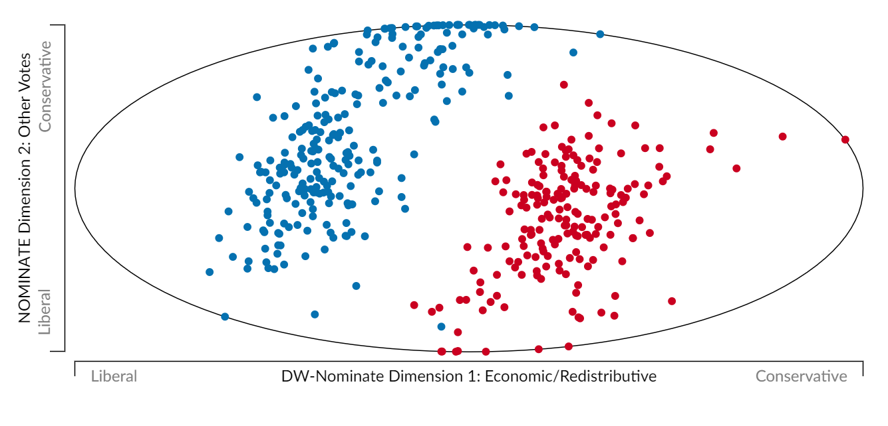
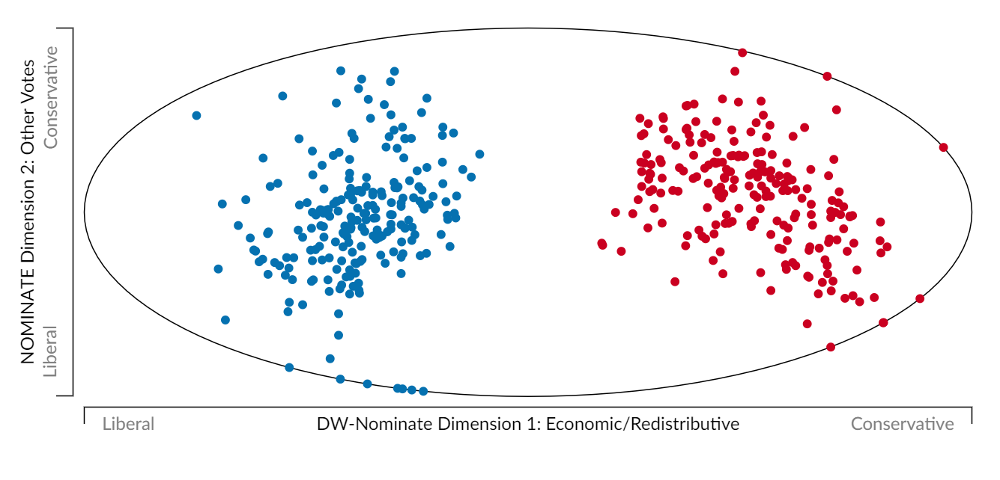
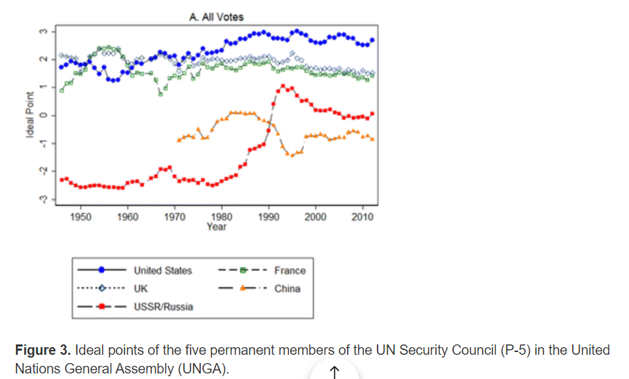
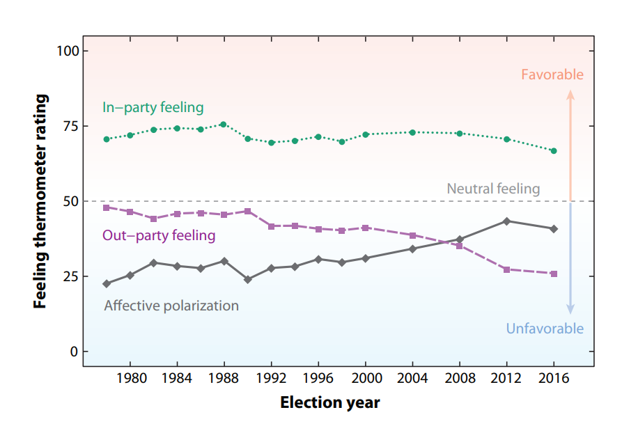

```{r setup, include=FALSE}
knitr::opts_knit$set(root.dir = rprojroot::find_rstudio_root_file())
```

## Plan for today

- Introducing myself
- What this course is about
- Syllabus and requirements
- Why do you need this course?
- Questions?

## Introducing myself

- M.A. student (3rd year/writing thesis) \pause
- Interests: political behavior, political economy, quantitative methods \pause 
- Thesis topic: social sorting and affective polarization in Canada \pause 
- Recent work with Profs. Stolle, Gidengil, and Pelc \pause

## Research projects I'm working on

- Does anxiety about coronavirus weaken citizens' commitment to democracy? \pause
- Social sorting/cross-cutting cleavages in Canada \pause
- Decline of local news and attitudes toward trade 

## Empirical vs normative 

We have to distinguish between empirical research and normative research \pause

\metroset{block=fill}
\begin{block}{Normative}
  Focuses on: ``shoulds" -- on how things ought to be
  \newline Character: Value-based and prescriptive
  \newline Methods: Persuasion, logic
\end{block}
\pause
\begin{block}{Empirical}
  Focuses on: Measuring and observing how things are 
  \newline Character: Observational, descriptive, predictive
  \newline Methods: Collect evidence from the real world and process   that evidence using the scientific method 
\end{block}

## Empirical vs normative 

Things are not quite as neat in the real world! \pause

- Normative political science makes use of empirical political science \pause
- And empirical political science often proceeds based on normative assumptions \pause

From the normative statement: "Men and women need equal representation in legislatures"... \pause

1. Does gender equality in legislatures lead to more family-friendly policies?
2. Do quotas mandating a minimum proportion of women in legislatures decrease the quality of legislative output?

## Zooming in on empirical

In empirical political science, we focus on *inferring* things about the political world \pause

- Infer: Form a belief based on a) evidence, and b) rules for processing that evidence \pause

3 types of inference: \pause

- Descriptive inference: What are the facts? \pause
- Causal inference: Why does something occur? \pause
- Predictive inference: How will things shake out? \pause

## Descriptive inference



Source: Gerring [-@gerring_mere_2012]

New: [Journal of Quantitative Description](https://journalqd.org/)

## Descriptive inference: DW-NOMINATE scores



DW-NOMINATE scores for the 90th Congress (1967-1969)

## Descriptive inference: DW-NOMINATE scores



DW-NOMINATE scores for the 117th Congress (current)

[See here: VoteView](https://voteview.com/congress/house)

## Descriptive inference: UN voting



Source: Bailey, Voeten and Strezhnev [-@bailey_estimating_2017]

## Descriptive inference: affective polarization

{width=90%}

Source: Iyengar et al. [-@iyengar_origins_2019]

## Causal inference

Causal inference is about *why* \pause

- If X (our *independent variable*) happens, what happens to Y (our *dependent variable*) \pause

Taking our congressional polarization example: 
- As DV: Why did Congress polarize? 
- As IV: What sort of consequences has congressional polarization had?

We care a lot about causality \pause

- But it is *very hard* to establish credibly!
- Recently: more credible causal claims \pause

## Cool things we've learned with causal inference

- Returns to office: British MPs die a lot wealthier than if they had not been elected [@eggers_mps_2009] \pause
- Descriptive representation: black legislators are more responsive to black constituents and white legislators are more responsive to white constituents [@butler_politicians_2011] \pause

Some counterintuitive findings that may clash with your priors...

- Access to Western TV in East Germany *decreased* opposition to the East German regime [@kern_opium_2009] \pause
- The election of women has no effect on women's political participation and future candidacies [@broockman_female_2014] \pause
- For my own benefit: Giving out cookies during course evaluations causes better evaluations! [@hessler_availability_2018]

## Predictive inference 

Prediction is not causation! \pause

Example? What is something I can predict but not interpret causally? \pause

- Coming to office hours and grades in the class 

Sometimes all I want to do is be able to predict \pause

- For instance, political campaigns must decide which voters to target during a campaign
- They want to target persuadable voters who are on the fence
- They build models predicting turnout and vote choice 

# Why make me do this? 

## Some reasons 

- The most boring answer: because political scientists use empirical methods and we need to be able to understand! \pause 
  - Just about every area of political science has quantitative components! \pause
  - Even political theory! Theories of participatory democracy need to know if participation actually has the intended effects \pause
  
- Professional advancement \pause 
  - There are *a lot* of jobs for social scientists with skills in empirical analysis \pause
  - Facebook, Twitter, etc. have data science teams composed of many social scientists! \pause 
- Developing a toolbox for your research \pause 
- Engaging with broader scientific debates and controversies \pause 
- Because I need this course for my degree...

## Potentially the most important reason

Because people make empirical claims all the time! \pause

- And people make *bad* empirical claims all the time! \pause
- Why? \pause
  - Lack empirical competence \pause
  - Motivated reasoning \pause 
- One of your 1st readings: Gelman \pause

No one in this room can be the ultimate arbiter of empirical truth -- let's not pretend otherwise! \pause

- But claims exist on continuum of plausibility \pause
- Give you tools to assess credibility of claims 

## How are we feeling? 

POLLING QUESTION: FEELING EXCITED/OVERWHELMED/CURIOUS/ANXIOUS

## A note on learning methods 

I know this can be intimidating \pause 

- But this course is *not* math-heavy \pause
- Everyone can do well \pause
- But do try to keep up and use the resources given to you! \pause
- Don't hesitate to reach out

## Questions?

Any questions? \pause

Let's look at the syllabus now

## References {.allowframebreaks}

\footnotesize