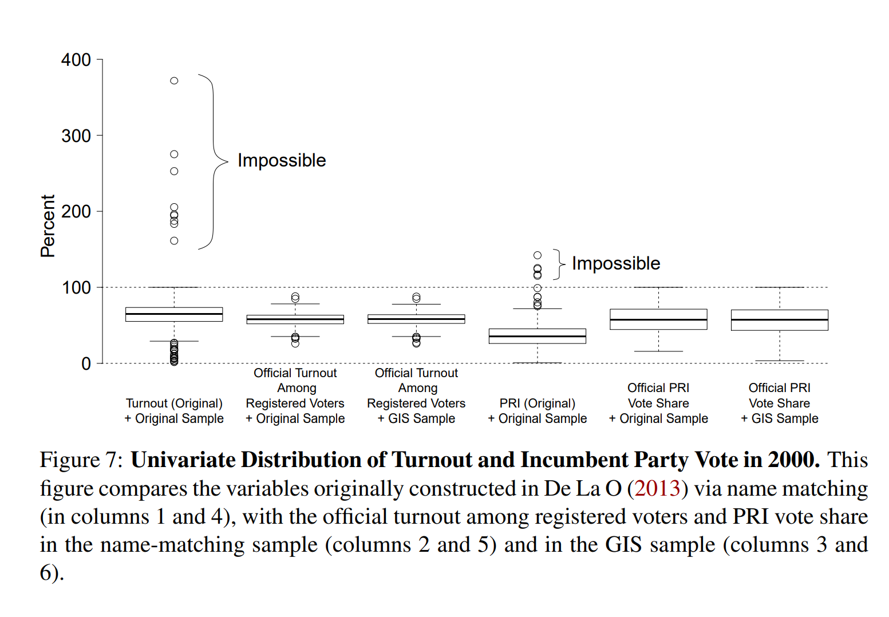

```{r setup, include=FALSE}
knitr::opts_knit$set(root.dir = rprojroot::find_rstudio_root_file())
knitr::opts_chunk$set(fig.height = 6, fig.width = 10, 
                      message = FALSE, warning = FALSE,
                      out.width = '75%')
```


```{r customtheme}
# taken from Andrew Heiss' website
library(ggtext)
theme_custom <- function(){
  theme_minimal(base_size = 19,
           base_family = "Fira Sans") %+replace%
  theme(legend.position = "none",
        panel.grid.minor = element_blank(),
        plot.title = element_markdown(face = "bold", size = rel(1.7)),
        plot.subtitle = element_markdown(face = "plain", size = rel(1.3)),
        axis.title = element_text(face = "bold"),
        axis.title.x = element_text(margin = margin(t = 10), hjust = 0),
        axis.title.y = element_text(margin = margin(r = 10), hjust = 1, angle = 90))
}
```


## Some harmless fun

{height='90%'}

## Boring admin stuff 

- Problem set 4 has been posted
  - Do it: I take the 3 best grades out of 4 psets; 13.3% each
  - Don't do it: I take the 3 pset grades; 13.3% each
  - Due November 15th
- Midterm next week
  - A combination of paragraph-length answers and essays
  - Don't lose the forest for the trees!
  - Focus on the broad issues, not on specifics

## Where we're going

We should now be able to describe the distribution of one variable

- The next step: describe how two variables move together 
- We will speak of **correlations**
  - When one variable is big/small, does that give me a clue about whether some other variable is big/small?
- We want to judge correlations according to two criteria: 
  - Direction
    - Positive correlation: when x is big, y is also big
    - Negative correlation: when x is big, y is small
  - Strength
    - How well can I guess the value of y if you give me x? 
- The **correlation coefficient** summarizes both of these 
  - It's a value between -1 and 1
  - Closer to -1 or 1: stronger relationship
    - Correlation of 0: no (linear) relationship 
  - The sign indicates the direction 
  
## Different correlations in scatterplots

```{r,out.width='100%',echo=FALSE,fig.height=6,fig.width=10,fig.cap='Scatterplots with different correlations'}
library(faux)
library(tidyverse)
library(ggplot2)
library(extrafont)
df <- matrix(nrow = 270, ncol = 3) %>% 
  as.data.frame() %>% rename(x = 1, y = 2, dist = 3)
j <- 1
set.seed(1031)
for(i in seq(1, 9, 1)){
  cors <- rnorm_multi(n = 30, 
                      mu = c(50, 50),
                      sd = c(10, 10),
                      r = (i/10),
                      empirical = TRUE)
  df[j:(j+29),1] <- cors[1]
  df[j:(j+29),2] <- cors[2]
  df[j:(j+29),3] <- paste("dist", i, sep = "")
  j <- j+30
}

cors <- df %>% 
  group_by(dist) %>% 
  summarise(cor = cor(x, y)) %>% 
  mutate(cor = paste("r =", cor))

df <- left_join(df, cors, by = "dist")

ggplot(df, aes(x = x, y = y)) +
  geom_point() +
  facet_wrap(~cor) +
  theme_bw(base_size = 19)
```
  
## The scatterplot as a visual tool: economic voting

```{r,fig.cap="Relationship between economic growth and incumbent vote share in the United States, 1792-2016. Data from Guntermann, Lenz, and Myers (2021).",echo=FALSE, out.width='95%'}
library(haven)
economy <- read_dta("lectures/lecture_10.2/dd.dta")

ggplot(economy, aes(x = gdpchangeyr3, y = partyincshr)) +
  geom_point(size = 3, alpha = 0.6) +
  theme_bw(base_size = 19, base_family = "Fira Sans") +
  labs(y = "Incumbent party's vote share",
       x = "% change in GDP in year leading up to election")
```

## Economic voting

The Pearson correlation coefficient: 

\scriptsize 

```{r}
cor(economy$gdpchangeyr3, economy$partyincshr, use = "pairwise")
```
\normalsize

A positive, moderately strong relationship

- As GDP growth increases, vote share for the incumbent tends to increase as well 

```{r,echo=FALSE}
library(dplyr)
library(knitr)
library(kableExtra)
tribble(~`r`, ~`Rough meaning`,
        "+/-0.1-0.3", "Modest", 
        "+/-0.3-0.5", "Moderate",
        "+/-0.5-0.8", "Strong", 
        "+/-0.8-1", "Very strong") %>% 
kbl(booktabs = TRUE) %>% 
  kable_styling(latex_options = "striped")
```


## Economic voting for each party

```{r,fig.cap="Relationship between economic growth and incumbent vote share in the United States, 1792-2016. Data from Guntermann, Lenz, and Myers (2021).",echo=FALSE, out.width='95%'}
economy$inc_party <- ifelse(economy$inc_party %in% c("Democrat", "Republican"), economy$inc_party, "Other")
ggplot(economy, aes(x = gdpchangeyr3, y = partyincshr, col = inc_party)) +
  geom_point(size = 3, alpha = 0.8) +
  theme_minimal(base_size = 19, base_family = "Fira Sans") %+replace%
  theme(legend.position = "bottom",
        panel.grid.minor = element_blank(),
        axis.title = element_text(face = "bold"),
        axis.title.x = element_text(margin = margin(t = 10), hjust = 0),
        axis.title.y = element_text(margin = margin(r = 10), hjust = 1, angle = 90)) +
  labs(y = "Incumbent party's vote share",
       x = "% change in GDP in year leading up to election") +
  scale_color_manual(values = c("#0015BC", "grey", "#E9141D"))
```

## Economic voting for each party

```{r,fig.cap="Relationship between economic growth and incumbent vote share in the United States, 1792-2016. Data from Guntermann, Lenz, and Myers (2021).",echo=FALSE, out.width='95%'}
economy$inc_party <- ifelse(economy$inc_party %in% c("Democrat", "Republican"), economy$inc_party, "Other")
ggplot(economy, aes(x = gdpchangeyr3, y = partyincshr, col = inc_party)) +
  geom_point(size = 3, alpha = 0.8) +
  theme_minimal(base_size = 19, base_family = "Fira Sans") %+replace%
  theme(legend.position = "bottom",
        panel.grid.minor = element_blank(),
        axis.title = element_text(face = "bold"),
        axis.title.x = element_text(margin = margin(t = 10), hjust = 0),
        axis.title.y = element_text(margin = margin(r = 10), hjust = 1, angle = 90)) +
  labs(y = "Incumbent party's vote share",
       x = "% change in GDP in year leading up to election") +
  scale_color_manual(values = c("#0015BC", "grey", "#E9141D")) +
  facet_wrap(~inc_party) +
  guides(col = FALSE)
```

## Economic voting for each party

\scriptsize

```{r}
library(tidyverse)
economy %>% 
  group_by(inc_party) %>% 
  summarise(cor = cor(gdpchangeyr3, partyincshr, use = "pairwise"))
```
\normalsize

It looks like the correlation is stronger for Republican incumbents!

Is this a causal relationship? \pause

- Maybe...maybe not!
- We could think of many **confounders**
  - A confounders is related to both X and Y
  - International economy, partisan control of Congress...

## College majors: women and income

```{r,echo=FALSE,out.width='100%',fig.height=7,fig.width=10}
library(viridis)
majors <- read.csv("lectures/lecture_10.2/majors.csv")

options(scipen = 999)
ggplot(majors, aes(x = ShareWomen, y = Median, size = Total,
                   col = ShareWomen)) +
  geom_point() +
  geom_text(aes(x = 0.75, y = 60000), 
            label = "Pearson's r = -0.62",
            size = 6,
            inherit.aes = FALSE) +
  theme_minimal(base_size = 19, base_family = "Fira Sans") %+replace%
  theme(legend.position = "bottom",
        panel.grid.minor = element_blank(),
        axis.title = element_text(face = "bold"),
        axis.title.x = element_text(margin = margin(t = 10), hjust = 0),
        axis.title.y = element_text(margin = margin(r = 10), hjust = 1, angle = 90)) +
  scale_color_viridis_c(option = "plasma", begin = 1, end = 0.2) +
  scale_y_continuous(breaks = seq(0, 110000, 10000)) +
  guides(size = FALSE, col = FALSE) +
  labs(x = "Proportion of women in a major",
       y = "Median income of graduates")
```

## College majors: women and unemployment

```{r,echo=FALSE,out.width='100%',fig.height=7,fig.width=10}
options(scipen = 999)
ggplot(majors, aes(x = ShareWomen, y = Unemployment_rate, size = Total,
                   col = ShareWomen)) +
  geom_point() +
  geom_text(aes(x = 0.75, y = 0.13), 
            label = "Pearson's r = 0.07",
            size = 6,
            inherit.aes = FALSE) +
  theme_minimal(base_size = 19, base_family = "Fira Sans") %+replace%
  theme(legend.position = "bottom",
        panel.grid.minor = element_blank(),
        axis.title = element_text(face = "bold"),
        axis.title.x = element_text(margin = margin(t = 10), hjust = 0),
        axis.title.y = element_text(margin = margin(r = 10), hjust = 1, angle = 90)) +
  scale_color_viridis_c(option = "plasma", begin = 1, end = 0.2) +
  guides(size = FALSE, col = FALSE) +
  labs(x = "Proportion of women in a major",
       y = "Unemployment rate of graduates")
```

## College majors: correlation coefficients

\scriptsize

```{r}
cor(majors$ShareWomen, majors$Median, 
    use = "pairwise")
cor(majors$ShareWomen, majors$Unemployment_rate, 
    use = "pairwise")
```
\normalsize 

`Share of women` and `Median salary`: a strong negative correlation

`Share of women` and `Unemployment`: basically no association


## TV shows

```{r,echo=FALSE,out.width='100%'}
library(ggrepel)
library(ggtext)
library(viridis)
library(viridisLite)
shows <- read.csv("lectures/lecture_10.2/tv_shows.csv")
show_level <- shows %>% 
  filter(seasonNumber %in% c(1,2) & title != "Twin Peaks") %>% 
  dplyr::select(titleId, title, seasonNumber, av_rating, share) %>% 
  distinct() %>% 
  pivot_wider(id_cols = titleId:title, 
              names_from = "seasonNumber",
              values_from = c("av_rating")) %>% 
  mutate(diff = `2` - `1`) %>% 
  mutate(label = ifelse(`1` >9 & `2` <9, title, ""))

ggplot(show_level, aes(x = `1`, y = `2`, col = diff,
                       label = label)) +
  geom_point() +
  geom_label_repel() +
  scale_x_continuous(limits = c(5, 10)) +
  scale_y_continuous(limits = c(5, 10)) +
  labs(x = "Season 1 IMdB rating",
       y = "Season 2 IMdB rating",
       title = "Scatterplot of TV show ratings",
       subtitle = "<span style='color: #000004FF'>Dark</span>/<span style='color: #F76F5CFF'>light</span> color: season 2 is <span style='color: #000004FF'>worse</span>/<span style='color: #F76F5CFF'>better</span>") +
  scale_colour_viridis_b(option = "A", begin = 0, end = 0.7) +
  theme_minimal(base_size = 19, base_family = "Fira Sans") %+replace%
  theme(legend.position = "none",
        panel.grid.minor = element_blank(),
        plot.title = element_markdown(face = "bold", size = rel(1.7)),
        plot.subtitle = element_markdown(face = "plain", size = rel(1.3)),
        axis.title = element_text(face = "bold"),
        axis.title.x = element_text(margin = margin(t = 10), hjust = 0),
        axis.title.y = element_text(margin = margin(r = 10), hjust = 1, angle = 90))
```

## TV shows

\scriptsize 

```{r}
cor(show_level$`1`, show_level$`2`, use = "pairwise")
```
\normalsize 

Wow, that's a really strong correlation!

- How to interpret? 
- Knowing how well-rated the first season is, you can make a very good guess as to the rating of the second season 
- Do you think the relationship is as strong between season 1 and season 5? 

## Seasons 1 and 5

```{r,echo=FALSE,out.width='100%'}
show_level_1_5 <- shows %>% 
  filter(seasonNumber %in% c(1,5) & title != "Twin Peaks") %>% 
  dplyr::select(titleId, title, seasonNumber, av_rating, share) %>% 
  distinct() %>% 
  pivot_wider(id_cols = titleId:title, 
              names_from = "seasonNumber",
              values_from = c("av_rating")) %>% 
  mutate(diff = `5` - `1`,
         label = ifelse(`1` < 7.05 | 
                          (`1` < 8 & `5` >9), title, ""))

ggplot(show_level_1_5, aes(x = `1`, y = `5`, col = diff, label = label)) +
  geom_point() +
  geom_label_repel() +
  labs(x = "Season 1 IMdB rating",
       y = "Season 5 IMdB rating",
       title = "Scatterplot of TV show ratings",
       subtitle = "<span style='color: #000004FF'>Dark</span>/<span style='color: #F76F5CFF'>light</span> color: season 5 is <span style='color: #000004FF'>worse</span>/<span style='color: #F76F5CFF'>better</span>") +
  scale_y_continuous(limits = c(7, 10)) +
  scale_x_continuous(limits = c(7, 10)) +
  scale_colour_viridis_b(option = "A", begin = 0, end = 0.7) +
  theme_minimal(base_size = 19, base_family = "Fira Sans") %+replace%
  theme(legend.position = "none",
        panel.grid.minor = element_blank(),
        plot.title = element_markdown(face = "bold", size = rel(1.7)),
        plot.subtitle = element_markdown(face = "plain", size = rel(1.3)),
        axis.title = element_text(face = "bold"),
        axis.title.x = element_text(margin = margin(t = 10), hjust = 0),
        axis.title.y = element_text(margin = margin(r = 10), hjust = 1, angle = 90))
```

## Seasons 1 and 5

\scriptsize

```{r}
cor(show_level_1_5$`1`, show_level_1_5$`5`, use = "pairwise")

# you can change the order; doesn't matter
cor(show_level_1_5$`5`, show_level_1_5$`1`, use = "pairwise")
```
\normalsize

The correlation is weaker, but still quite strong 

- Scatterplots are very useful -- **always** plot your data 
- But must be careful in how you interpret them
- The scale for seasons 1 and 5 is different $\leadsto$ correlation looks weaker than it is

## Linearity

The correlation coefficient evaluates **linear** covariation

- What is a linear relationship? 
- In response to a change in $X$, $Y$ behaves in a particular way, *no matter the value of $X$*
- Non-linear relationship: the association between $X$ and $Y$ differs based on the value of $X$

## Non-linearity: London Airbnb listings

```{r,include=FALSE,out.width='80%',fig.cap="Longitude and price of London (UK) Airbnb listings on March 4th, 2017"}
library(binsreg)
london <- read_csv("lectures/lecture_10.2/airbnb_london_cleaned.csv")
airbnb_plot <- binsreg(london$price, london$longitude)$bins_plot
```

```{r,echo=FALSE,out.width='85%',fig.cap="Longitude and price of London (UK) Airbnb listings on March 4th, 2017"}
airbnb_plot +
  labs(x = "Longitude of the listing",
       y = "Price (in pounds)") +
  theme_custom()
```

\scriptsize 

```{r}
cor(london$price, london$longitude, use = "pairwise")
```


## Equivalent relationships 

[Navigate to this link](https://media.giphy.com/media/KGYIA3dwufPlN9qNjn/source.gif)

- For all of these scatterplots, the summary stats are the same!
  - Same mean, same correlation, etc. 
- And yet, looking at the scatterplots, the relationships are very different
- *Always* plot your data! 
- Before doing any fancy statistics...
  - Look at the distribution of $X$
    - Do any cases stand out? 
  - Look at the distribution of $Y$
    - Do any cases stand out? 
  - Look at a scatterplot of $X$ and $Y$
    - Do any cases stand out? 
    
## Not plotting your data? You might screw up



## Scatterplot matrices

\scriptsize 

```{r,echo=FALSE,out.width='100%'}
library(GGally)
county <- read_csv("lectures/lecture_10.2/county_pres.csv")

county_per_elec <- county %>% 
  mutate(prop_vote = candidatevotes/totalvotes) %>% 
  filter(party == "DEMOCRAT") %>% 
  dplyr::select(county_fips, year, prop_vote) %>% 
  distinct(county_fips, year, .keep_all = TRUE) %>% 
  pivot_wider(id_cols = c("county_fips", "year"), 
              names_from = "year", 
              values_from = "prop_vote")

county_per_elec %>% 
  dplyr::select(-county_fips:-`2008`) %>% 
  ggpairs(lower = list(
    continuous = wrap("points", size = 0.2, alpha = 0.4))) +
  theme_custom() +
  labs(x = "Proportion of vote for D candidate in one election",
       y = "Proportion of vote for D candidate in another election")
```


## References {.allowframebreaks}

\footnotesize
