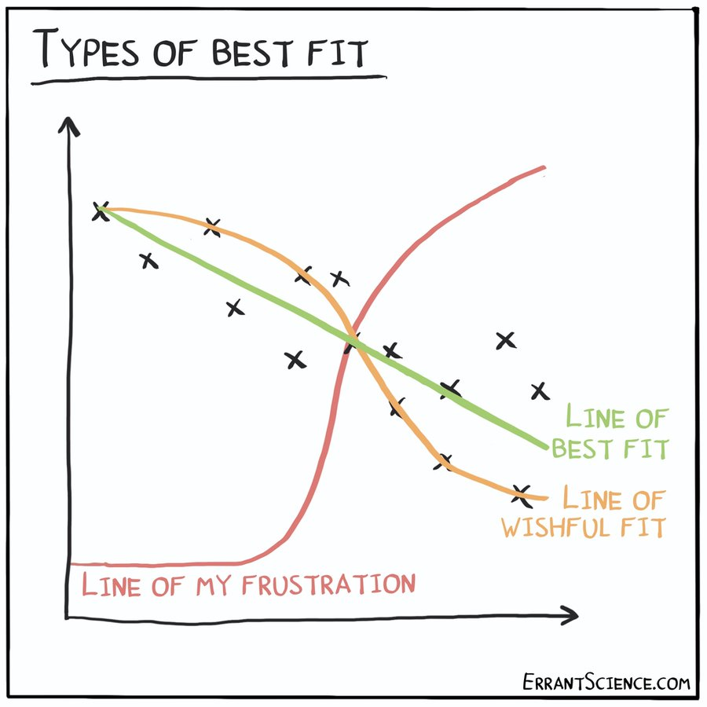
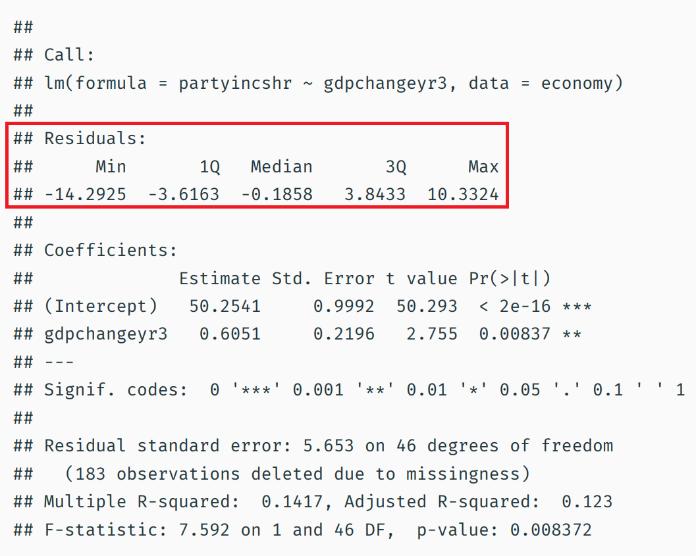
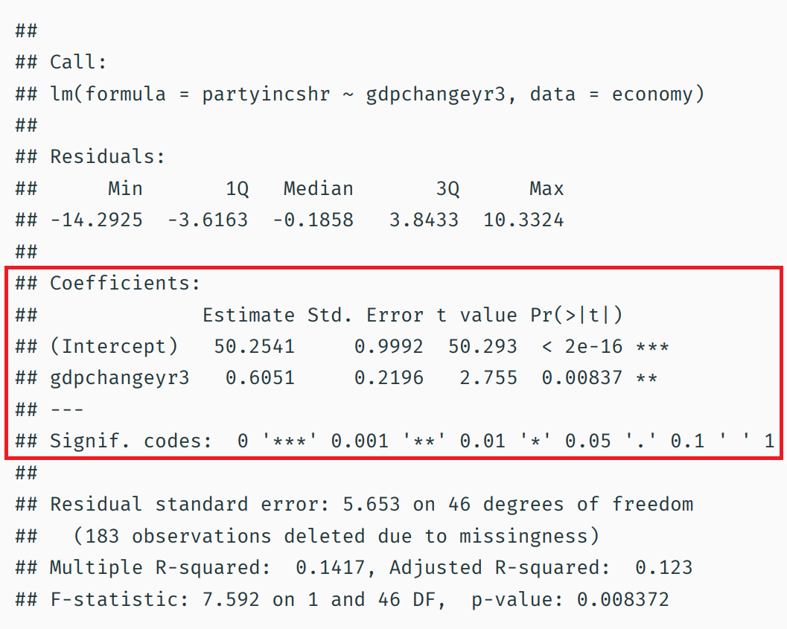
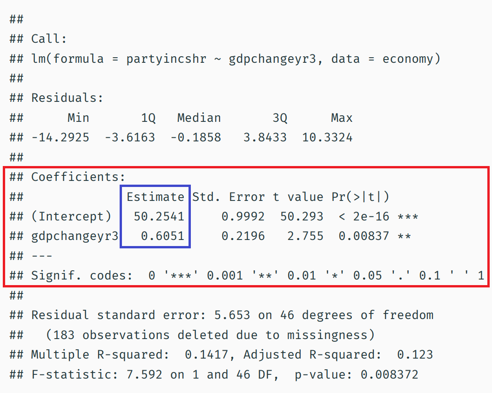
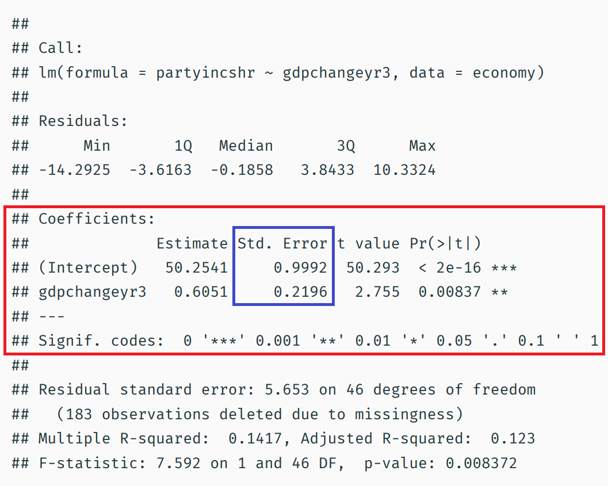
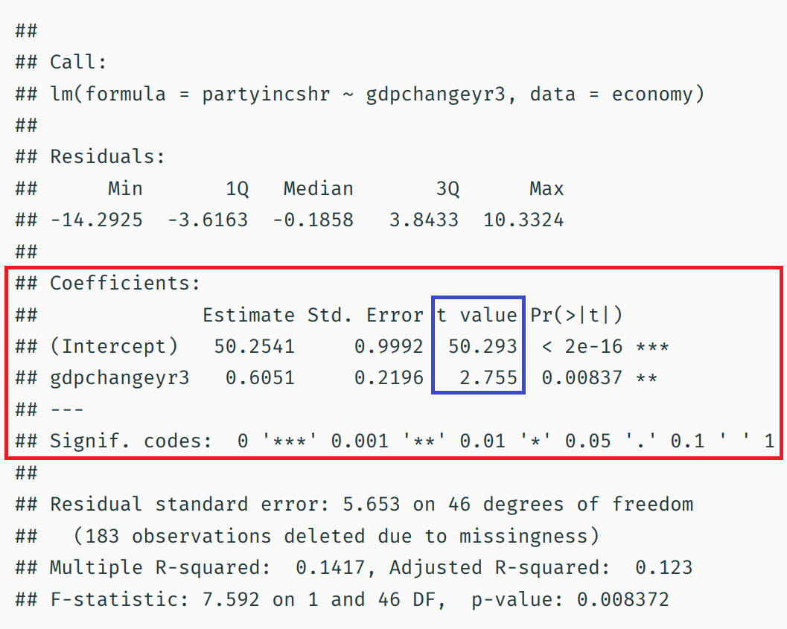
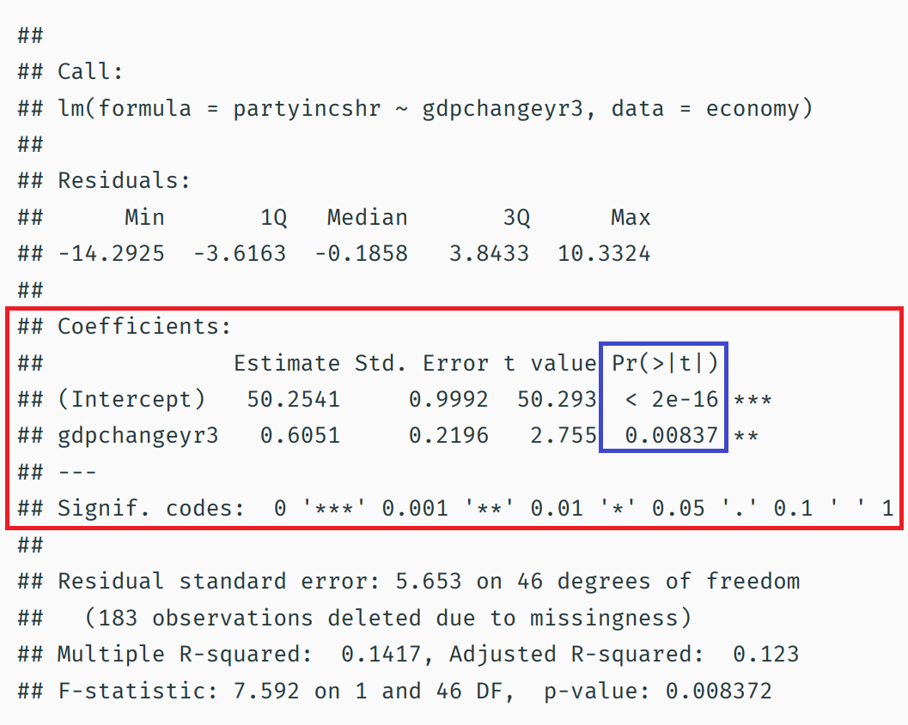

```{r setup, include=FALSE}
knitr::opts_knit$set(root.dir = rprojroot::find_rstudio_root_file())
knitr::opts_chunk$set(fig.height = 6, fig.width = 10, 
                      echo=FALSE,
                      message = FALSE, warning = FALSE,
                      out.width = '75%')
```

```{r customtheme,echo=FALSE}
# taken from Andrew Heiss' website
library(ggtext)
theme_custom <- function(){
  theme_minimal(base_size = 19,
           base_family = "Fira Sans") %+replace%
  theme(legend.position = "none",
        panel.grid.minor = element_blank(),
        plot.title = element_markdown(face = "bold", size = rel(1.7)),
        plot.subtitle = element_markdown(face = "plain", size = rel(1.3)),
        axis.title = element_text(face = "bold"),
        axis.title.x = element_text(margin = margin(t = 10), hjust = 0),
        axis.title.y = element_text(margin = margin(r = 10), hjust = 1, angle = 90))
}
```

## Boring admin stuff

- More appointments with me available
- Lots of tutoring sessions
- I know there's a lot going on
  - I'm offering as much help as I can -- use it!

## Cats

\begin{figure}[ht] 
  \label{ fig7} 
  \begin{minipage}[b]{0.5\linewidth}
    \centering
    \includegraphics[]{clem.jpg}
  \end{minipage}%%
  \begin{minipage}[b]{0.5\linewidth}
    \centering
    \includegraphics[]{arthur.jpg} 
  \end{minipage} 
  \begin{minipage}[b]{0.5\linewidth}
    \centering
    \includegraphics{lili.jpg} 
    \vspace{4ex}
  \end{minipage}%% 
  \begin{minipage}[b]{0.5\linewidth}
    \centering
    \includegraphics{oscar.jpg} 
    \vspace{4ex}
  \end{minipage} 
\end{figure}

## The limitations of correlation coefficients

Two limitations:

- Does not give an estimate of the **magnitude** of the effect
  - If $X$ increases by one unit, by how much can I expect $Y$ to change?
- Does not allow us to "control" for other variables
  - By "controlling" for confounders, we will be able to make more plausible claims about causality

## Correlation does not indicate magnitude of the effect

```{r,echo=FALSE,out.width='80%'}
library(faux)
library(ggplot2)
library(tidyverse)
library(extrafont)

set.seed(1011)
cors1 <- rnorm_multi(n = 50, mu = c(50,50), sd = c(10, 10), r = 0.8) %>% 
  mutate(type = "Strong effect")
cors2 <- rnorm_multi(n = 50, mu = c(50,50), sd = c(10, 2), r = 0.8) %>% 
  mutate(type = "Weak effect")

cors <- rbind(cors1, cors2)

ggplot(cors, aes(x = X1, y = X2)) +
  geom_point() +
  facet_wrap(~type) +
  theme_custom()
```

\footnotesize

```{r}
cor(cors1$X1, cors1$X2)
cor(cors2$X1, cors2$X2)
```

## What we want to do

\centering

```{r,echo=FALSE,out.width='90%'}
library(haven)
economy <- read_dta("lectures/lecture_10.2/dd.dta")

base_econ_plot <- 
  ggplot(economy, aes(x = gdpchangeyr3, y = partyincshr)) +
  geom_point(size = 3, alpha = 0.6) +
  theme_custom() +
  labs(y = "Incumbent party's vote share",
       x = "% change in GDP in year leading up to election") +
  xlim(-10, 15) +
  ylim(28, 68)
base_econ_plot
```

\raggedright

Our objective: draw a line through the points that best represents the relationship

## Back to middleschool

We can represent lines in a graph using the following equation: $f(x) = ax + b$

- $f(x)$: the value of y; it's determined by the right-hand side of the equation
- $ax$: some constant multiplied by x
  - $a$ is the slope of my line
- $b$: the intercept

If I'm given the values $a$, $x$, and $b$, I can find the value of y

## A linear function

Let's consider a simple function $f(x) = 2x + 4$

```{r, out.height="60%"}
linear_plot <- data.frame(x = 0:10,
           y = seq(4, 24, 2)) %>% 
ggplot(aes(x = x, y = y)) +
  geom_line() +
  scale_x_continuous(breaks = 0:10) +
  scale_y_continuous(breaks = seq(0, 24, 2),
                     limits = c(0, 24)) +
  theme_custom()

linear_plot
```

$b$ = 0, because $y$ is equal to 0 when $x$ is equal to 0

$a$ = 2, because for each increase of 1 unit in $x$, $y$ increases by 2 units

## Regression notation

What we'll be doing: fit a line through the points

- We will want to find a rule that allows us to choose the best line
- This is the "line of best fit"

The line of best fit is generally expressed in the following way:

$$Y_i = \beta_0 + \beta_1X_1 + \epsilon_i$$


## Line of best fit or...?

{height='90%'}

## Our first attempt

$\text{VoteShare}_i = \beta_0 + \beta_1\text{Growth}_i + \epsilon_i$

```{r,out.width='100%'}
base_econ_plot +
  geom_abline(intercept = 40, slope = 1.5, size = 1,
              col = "steelblue")
```

Here, I arbitrarily chose a line: $f(x) = 1.5*GDP + 40$

In other words, I set $\beta_0$ to 40 and $\beta_1$ to 1.5

## Our first attempt

```{r,out.width='100%'}
library(ggrepel)
economy_1932 <- economy %>% 
  mutate(label = ifelse(
    year == 1932,
    paste("Year: ", year, "\n", 
          "GDP change: ", round(gdpchangeyr3, 1), "\n",
          "Incumbent %: ", round(partyincshr, 1),
          sep = ""),
    ""
  ))
ggplot(economy_1932, 
       aes(x = gdpchangeyr3, y = partyincshr, label = label)) +
  geom_point(size = 3, alpha = 0.6) +
  geom_label_repel(box.padding = 1, nudge_y = 0.3,
                   segment.color = NA) +
  geom_abline(intercept = 40, slope = 1.5, size = 1,
              col = "steelblue") +
  theme_custom() +
  labs(y = "Incumbent party's vote share",
       x = "% change in GDP in year leading up to election") +
  xlim(-10, 15) +
  ylim(28, 68) 
```

Let's focus on a single point: the 1932 election

## Our first attempt: residual for the 1932 observation

```{r,out.width='90%'}
economy_1932 %>% 
  mutate(yend = ifelse(year == 1932, 40 + 1.5*gdpchangeyr3, NA_real_)) %>% 
  mutate(label = ifelse(
    year == 1932,
    paste("Year: ", year, "\n", 
          "GDP change: ", round(gdpchangeyr3, 1), "\n",
          "Incumbent %: ", round(partyincshr, 1), "\n",
          "Predicted %: ", round(40+1.5*gdpchangeyr3, 1),
          sep = ""),
    ""
  )) %>% 
  ggplot(aes(x = gdpchangeyr3, y = partyincshr, label = label,
           xend = gdpchangeyr3, yend = yend)) +
  geom_point(size = 3, alpha = 0.6) +
  geom_label_repel(box.padding = 1, nudge_y = 0.3,
                   segment.color = NA) +
  geom_abline(intercept = 40, slope = 1.5, size = 1,
              col = "steelblue") +
  geom_segment(col = "red", size = 1) +
  theme_custom() +
  labs(y = "Incumbent party's vote share",
       x = "% change in GDP in year leading up to election") +
  xlim(-10, 15) +
  ylim(28, 68) 
```

**Residual**: the difference between the actual outcome and our model's prediction of the outcome

- ${\color[HTML]{FF0000} \epsilon_i} = y_i - \hat{y_i} = 40.9 - 28.9 = 12.0$

## Our first attempt: all residuals

```{r,out.width='80%'}
economy_1932 %>% 
  mutate(yend = 40 + 1.5*gdpchangeyr3) %>% 
  mutate(label = ifelse(
    year == 1932,
    paste("Year: ", year, "\n", 
          "GDP change: ", round(gdpchangeyr3, 1), "\n",
          "Incumbent %: ", round(partyincshr, 1), "\n",
          "Predicted %: ", round(40+1.5*gdpchangeyr3, 1),
          sep = ""),
    ""
  )) %>% 
  ggplot(aes(x = gdpchangeyr3, y = partyincshr, label = label,
           xend = gdpchangeyr3, yend = yend)) +
  geom_point(size = 3, alpha = 0.6) +
  geom_abline(intercept = 40, slope = 1.5, size = 1,
              col = "steelblue") +
  geom_segment(col = "red", size = 1) +
  theme_custom() +
  labs(y = "Incumbent party's vote share",
       x = "% change in GDP in year leading up to election") +
  xlim(-10, 15) +
  ylim(28, 68) 
```

- We can compute the residual for each observation
- Why not try to minimize the sum of residuals? 
- Some are positive, some are negative; they will cancel out
- Instead, we want to choose a line that minimizes the **sum of squared errors**

## Sum of squared errors

Sum of squared errors (SSE): \hfill $\sum_{i=1}^{n}(y_i-\hat{y}_i)^2$

- With $n=3$: \hfill $(y_1-\hat{y}_1)^2 + (y_2-\hat{y}_2)^2 + (y_3-\hat{y}_3)^2$


## Our first attempt: why is it wrong?

Let's select just 3 observations to simplify the task

```{r}
set.seed(1015)
economy_1932 %>% 
  filter(!is.na(partyincshr)) %>% 
  sample_n(3) %>% 
  mutate(yend = 40 + 1.5*gdpchangeyr3) %>% 
  mutate(label = 
    paste("Year: ", year, "\n", 
          "GDP change: ", round(gdpchangeyr3, 1), "\n",
          "Incumbent %: ", round(partyincshr, 1), "\n",
          "Predicted %: ", round(40+1.5*gdpchangeyr3, 1),
          sep = "")) %>% 
  ggplot(aes(x = gdpchangeyr3, y = partyincshr, label = label,
           xend = gdpchangeyr3, yend = yend)) +
  geom_point(size = 3, alpha = 0.6)+
  geom_abline(intercept = 40, slope = 1.5, size = 1,
              col = "steelblue") + 
  geom_label_repel(box.padding = 1) + 
  geom_segment(col = "red", size = 1) +
  theme_custom() +
  labs(y = "Incumbent party's vote share",
       x = "% change in GDP in year leading up to election") +
  xlim(-10, 15) +
  ylim(28, 68) 
```

- $y_i$: \hspace{2cm} $52.0, 46.3,54.4$ \pause
- $\hat{y}_i$: \hspace{2cm} $41.3,46.3,47.0$ \pause
- $\epsilon_i$: \hspace{2cm} $10.7, 00.0, 07.4$ \pause
- SSE: \hspace{2cm} $10.7^2 + 0^2 + 7.4^2 = 169.5$

## Our first attempt: why is it wrong?

Let's instead use $\beta_0 = 45$ and $\beta_1 = 1$

```{r}
set.seed(1015)
economy_1932 %>% 
  filter(!is.na(partyincshr)) %>% 
  sample_n(3) %>% 
  mutate(yend = 45 + gdpchangeyr3) %>% 
  mutate(label = 
    paste("Year: ", year, "\n", 
          "GDP change: ", round(gdpchangeyr3, 1), "\n",
          "Incumbent %: ", round(partyincshr, 1), "\n",
          "Predicted %: ", round(45+gdpchangeyr3, 1),
          sep = "")) %>% 
  ggplot(aes(x = gdpchangeyr3, y = partyincshr, label = label,
           xend = gdpchangeyr3, yend = yend)) +
  geom_point(size = 3, alpha = 0.6)+
  geom_abline(intercept = 45, slope = 1, size = 1,
              col = "steelblue") + 
  geom_label_repel(box.padding = 1) + 
  geom_segment(col = "red", size = 1) +
  theme_custom() +
  labs(y = "Incumbent party's vote share",
       x = "% change in GDP in year leading up to election") +
  xlim(-10, 15) +
  ylim(28, 68) 
```

- $y_i$: \hspace{2cm} $52.0, 46.3,54.4$ \pause
- $\hat{y}_i$: \hspace{2cm} $45.8,49.2,49.6$ \pause
- $\epsilon_i$: \hspace{2cm} $6.2, -2.9, 4.8$ \pause
- SSE: \hspace{2cm} $6.2^2 + -2.9^2 + 4.8^2 = 69.89$

## Running our regression

Of course, we don't have to do this by hand

- The command to run a linear regression in R is `lm()`
- Two main arguments:
  - formula, of format `y ~ x`
  - data
  
\footnotesize

```{r,echo=TRUE}
lm(partyincshr ~ gdpchangeyr3, 
   data = subset(economy, year %in% c(1852, 1860, 2012)))
```
## Visualizing the correct regression line 

```{r}
set.seed(1015)
economy_1932 %>% 
  filter(!is.na(partyincshr)) %>% 
  sample_n(3) %>% 
  mutate(yend = 51.67 - 0.2373*gdpchangeyr3) %>% 
  mutate(label = 
    paste("Year: ", year, "\n", 
          "GDP change: ", round(gdpchangeyr3, 1), "\n",
          "Incumbent %: ", round(partyincshr, 1), "\n",
          "Predicted %: ", round(51.67-0.2373*gdpchangeyr3, 1),
          sep = "")) %>% 
  ggplot(aes(x = gdpchangeyr3, y = partyincshr, label = label,
           xend = gdpchangeyr3, yend = yend)) +
  geom_point(size = 3, alpha = 0.6)+
  geom_abline(intercept = 51.67, slope = -0.2373, size = 1,
              col = "steelblue") + 
  geom_label_repel(box.padding = 1) + 
  geom_segment(col = "red", size = 1) +
  theme_custom() +
  labs(y = "Incumbent party's vote share",
       x = "% change in GDP in year leading up to election") +
  xlim(-10, 15) +
  ylim(28, 68) 
```

::: columns

:::: column

```{r}
model_3obs <- lm(partyincshr ~ gdpchangeyr3, 
   data = subset(economy, year %in% c(1852, 1860, 2012)))
library(knitr)
library(kableExtra)
results <- data.frame(
  i = 1:3,
  y = model_3obs$model$partyincshr %>% round(2),
  y_hat = model_3obs$fitted.values %>% round(2)
) %>% 
  mutate(epsilon = y - y_hat,
         epsilon_sq = epsilon^2 %>% round(2))

colnames(results) <- c("$i$", "$y_i$", "$\\hat{y}_i$", 
                       "$\\epsilon_i$", "$\\epsilon_i^2$")
knitr::kable(results, booktabs = TRUE, format = "latex",
             escape = FALSE)
```

::::

:::: column

Sum of Squared Errors: $18.92 + 14.82 + 0.24 = 33.98$


::::

:::

## Back to our full data

```{r}
base_econ_plot +
  geom_smooth(method = "lm",
              se = FALSE)
```

## Linear regression with our full data

\footnotesize 

```{r,echo=TRUE}
lm(formula = partyincshr ~ gdpchangeyr3, 
   data = economy)
```

\normalsize

This is okay...but there's not a lot of information!

## Linear regression with our full data

\scriptsize

```{r,echo=TRUE}
lm(formula = partyincshr ~ gdpchangeyr3, data = economy) %>% summary()
```

## Interpreting our results

{height='95%'}

## Interpreting our results

{height='95%'}

## Interpreting our results

{height='95%'}

## Interpreting our results

{height='95%'}

## Interpreting our results

{height='95%'}

## Interpreting our results

{height='95%'}

## Interpreting our results

{height='95%'}

## Interpreting our results

{height='95%'}

## How results generally appear in published work

```{r}
library(modelsummary)
model_full <- lm(formula = partyincshr ~ gdpchangeyr3, data = economy)
modelsummary(model_full,
             stars = TRUE,
             coef_rename = c("gdpchangeyr3" = "GDP change (year 3)"),
             gof_omit = "AIC|BIC|Log.Lik.|F")
```

## Predicting income 

```{r,echo=FALSE,out.width='100%',fig.height=7,fig.width=10}
library(viridis)
majors <- read.csv("lectures/lecture_10.2/majors.csv")

options(scipen = 999)
ggplot(majors, aes(x = ShareWomen, y = Median, size = Total,
                   col = ShareWomen)) +
  geom_point(alpha = 0.4) +
  geom_smooth(method = "lm", col = "black", se = FALSE) +
  theme_custom() +
  scale_color_viridis_c(option = "plasma", begin = 1, end = 0.2) +
  scale_y_continuous(breaks = seq(0, 110000, 10000)) +
  guides(size = FALSE, col = FALSE) +
  labs(x = "Proportion of women in a major",
       y = "Median income of graduates")
```

## A linear regression model predicting income

```{r}
income_model <- lm(formula = Median ~ ShareWomen, data = majors)
modelsummary(income_model,
             stars = TRUE,
             coef_rename = c("ShareWomen" = "Proportion of women"),
             gof_omit = "AIC|BIC|Log.Lik.|F")
```


