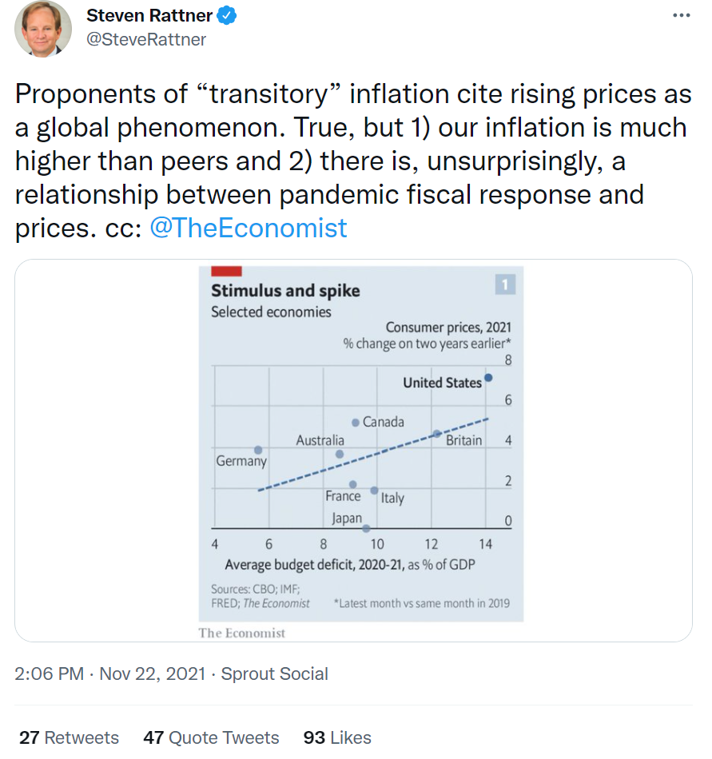
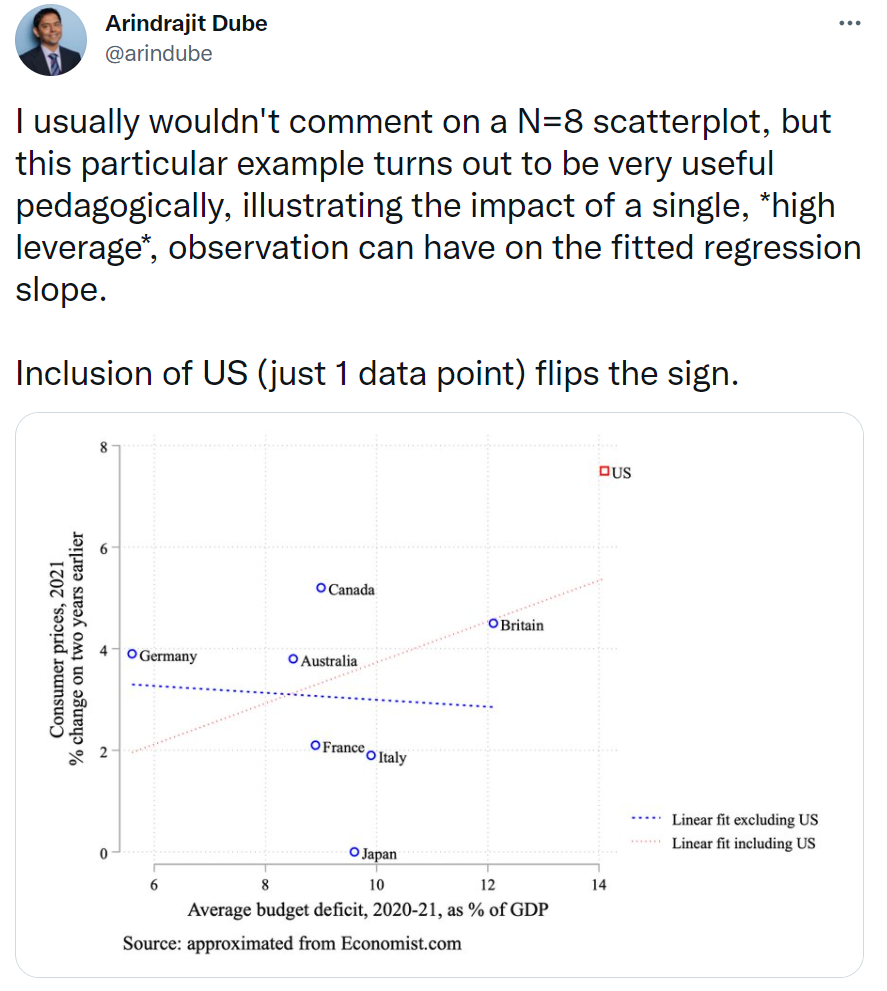
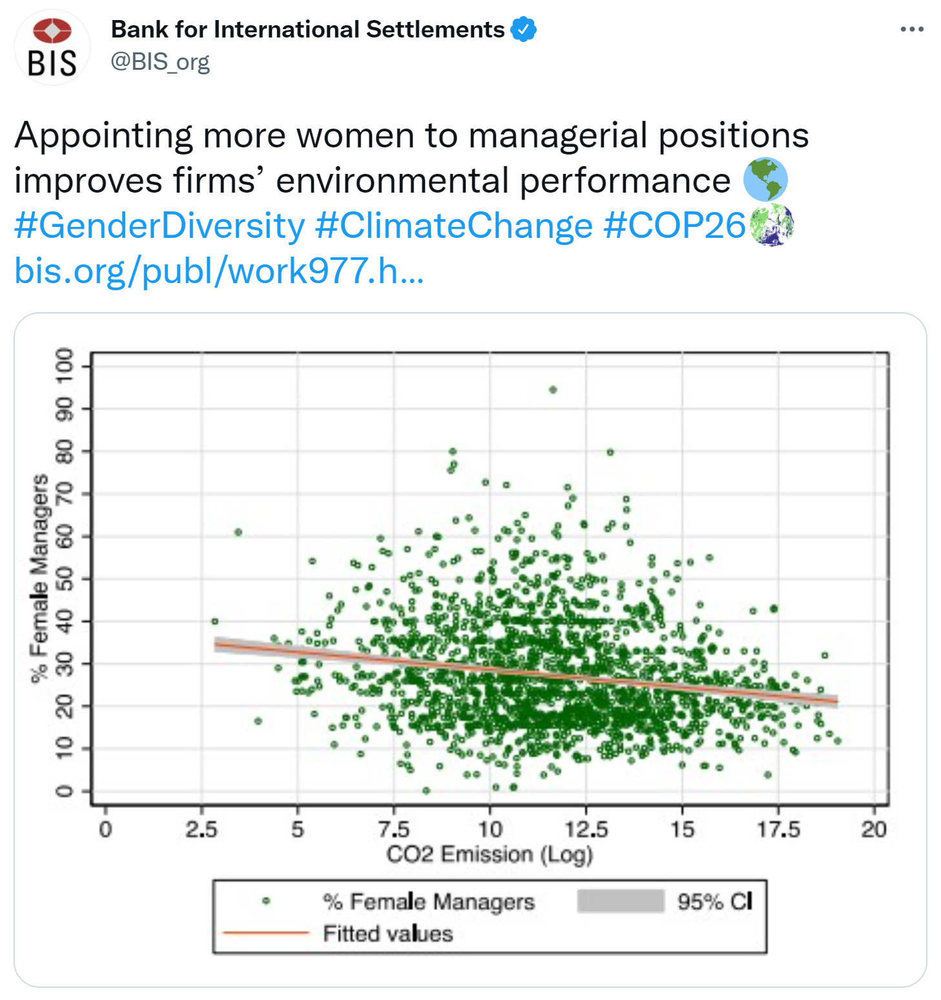

```{r setup, include=FALSE}
knitr::opts_knit$set(root.dir = rprojroot::find_rstudio_root_file())
knitr::opts_chunk$set(fig.height = 6, fig.width = 10, 
                      echo=FALSE,
                      message = FALSE, warning = FALSE,
                      out.width = '90%')
```

```{r customtheme,echo=FALSE}
# taken from Andrew Heiss' website
library(ggtext)
theme_custom <- function(){
  theme_minimal(base_size = 19,
           base_family = "Fira Sans") %+replace%
  theme(legend.position = "none",
        panel.grid.minor = element_blank(),
        plot.title = element_markdown(face = "bold", size = rel(1.7)),
        plot.subtitle = element_markdown(face = "plain", size = rel(1.3)),
        axis.title = element_text(face = "bold"),
        axis.title.x = element_text(margin = margin(t = 10), hjust = 0),
        axis.title.y = element_text(margin = margin(r = 10), hjust = 1, angle = 90))
}

library(modelsummary)
```

## Boring admin stuff

- Due dates:
  - Problem set: December 2nd
    - Try to knit right now! 
  - Team project: December 6th
  - Quiz: December 2nd to December 6th -- no late penalty until the 17th
    - Will be posted soon 
- Please complete course evals on Minerva

## Adding more covariates

As seen repeatedly in the class, correlation $\neq$ causation

- Why? Because of **confounders**
- But if we can "adjust" for all relevant confounders ("control" for them)
- We have a stronger claim to causality 
- In addition, from a predictive inference framework, we can make better predictions of the value $Y$ will take on 

In our regressions, we will include additional covariates

- Covariates = independent variables = explanatory variables
- Just to be clear, we keep the same dependent variable
- But now seek to explain it using multiple variables 

## Our new regression equation 

With two independent variables, we now have: 

$$Y_i = \beta_0 + \beta_1X_1 + \beta_2X_2 + \epsilon_i$$
We still have our intercept, $\beta_0$

- But now we have one coefficient for each independent variable: $\beta_1$ and $\beta_2$
- Our interpretation of each coefficient is now a bit different
- $\beta_1$ representes the expected change in $Y$ occuring as a result of a one-unit change in $X_1$...**holding other covariates constant**
- In this case, holding $X_2$ constant
- What we can now say:
  - The association between $X_1$ and $Y$ that $\beta_1$ identifies is *not* due to confounding by $X_2$
  
## New regression model with incumbent data

```{r}
library(haven)
economy <- read_dta("lectures/lecture_10.2/dd.dta")
```

\scriptsize

```{r echo=TRUE}
reg2 <- lm(formula = partyincshr ~ gdpchangeyr3 + age,data = economy)
summary(reg2)
```

## Comparing our two models

```{r}
reg1 <- lm(formula = partyincshr ~ gdpchangeyr3,
           data = economy)
modelsummary(list(reg1, reg2),
             stars = TRUE,
             coef_rename = c("gdpchangeyr3" = "GDP change (year 3)",
                             "age" = "Age"),
             gof_omit = "AIC|BIC|Log.Lik.|F")
```

## Non-linear relationships are not well captured 

Linear regression models are good at estimating **linear** relationships 

- When the relationship between $X$ and $Y$ is non-linear, things get more complicated
- (There are ways to account for this, but that's for 311)
- In short, our $\beta$'s will not capture the relationship well 

## Airbnb's in London 

```{r,include=FALSE,out.width='80%',fig.cap="Longitude and price of London (UK) Airbnb listings on March 4th, 2017"}
library(binsreg)
london <- read.csv("lectures/lecture_10.2/airbnb_london_cleaned.csv")
airbnb_bins <- binsreg(london$price, london$longitude)$data.plot[[1]][[1]]
```

```{r,echo=FALSE,out.width='85%',fig.cap="Longitude and price of London (UK) Airbnb listings on March 4th, 2017"}
library(ggplot2)
library(extrafont)
library(dplyr)
airbnb_bins %>% 
  ggplot(aes(x = x, y = fit)) + 
  geom_point() +
  labs(x = "Longitude of the listing",
       y = "Price (in pounds)") +
  geom_smooth(method = "lm",
              se = FALSE,
              size = 1.25) +
  theme_custom()
```

## Airbnb's in London

\scriptsize

```{r}
lm(price ~ longitude, data = london) %>% summary()
```

## Outliers can mess with your results

```{r,out.width='95%'}
tucker <- read_dta("lectures/lecture_13.1/bjps_powell_tucker_dataset.dta")

ggplot(tucker, aes(x = GDPChange1989, y = TotalVol)) +
  geom_point(col = "darkblue", alpha = 0.7) +
  labs(x = "GDP change since 1989",
       y = "Volatility in the party system") +
  theme_custom()
```

## Outliers can mess with your results

```{r,out.width='95%'}
tucker <- read_dta("lectures/lecture_13.1/bjps_powell_tucker_dataset.dta")

ggplot(tucker, aes(x = GDPChange1989, y = TotalVol)) +
  geom_point(col = "darkblue", alpha = 0.7) +
  labs(x = "GDP change since 1989",
       y = "Volatility in the party system") +
  geom_smooth(method = "lm", size = 1.25, col = "darkred",
              se = FALSE) +
  theme_custom()
```

## Outliers can mess with your results

```{r,out.width='95%'}
tucker <- read_dta("lectures/lecture_13.1/bjps_powell_tucker_dataset.dta")

library(ggrepel)
tucker %>% 
  mutate(label = ifelse(Country == "Bosnia-Herzegovina",
paste(Country, Year1), "")) %>% 
ggplot(aes(x = GDPChange1989, y = TotalVol, label = label)) +
  geom_point(col = "darkblue", alpha = 0.7) +
  geom_label_repel() +
  labs(x = "GDP change since 1989",
       y = "Volatility in the party system") +
  geom_smooth(method = "lm", size = 1.25, col = "darkred",
              se = FALSE) +
  theme_custom()
```

## Outliers can mess with your results

```{r,out.width='95%'}
tucker <- read_dta("lectures/lecture_13.1/bjps_powell_tucker_dataset.dta")

tucker %>% 
  mutate(label = ifelse(Country == "Bosnia-Herzegovina",
paste(Country, Year1), "")) %>% 
ggplot(aes(x = GDPChange1989, y = TotalVol, label = label)) +
  geom_point(col = "darkblue", alpha = 0.7) +
  geom_label_repel() +
  labs(x = "GDP change since 1989",
       y = "Volatility in the party system") +
  geom_smooth(method = "lm", size = 1.25, col = "darkred",
              se = FALSE) +
  geom_smooth(data = filter(tucker, Country != "Bosnia-Herzegovina"),
              aes(x = GDPChange1989, y = TotalVol),
              method = "lm", size = 1.25, col = "darkred",
              se = FALSE, linetype = "dashed", inherit.aes = F) +
  theme_custom()
```

## Outliers can mess with your results

```{r}
m1_tucker <- lm(TotalVol ~ GDPChange1989, tucker)
m2_tucker <- lm(TotalVol ~ GDPChange1989, 
                filter(tucker, GDPChange1989 < 4.5))
modelsummary(list(m1_tucker,m2_tucker),
             stars = TRUE,
             coef_rename = c("GDPChange1989" = "GDP change since 1989"),
             gof_omit = "AIC|BIC|Log.Lik.|F")
```


## Outliers are not just a nuisance


## Outliers are not just a nuisance

```{r}
florida <- read.csv("lectures/lecture_13.1/florida.csv")

florida %>% 
  ggplot(aes(x = Perot96, y = Buchanan00)) +
  geom_point(col = "darkblue", alpha = 0.7) +
  theme_custom() +
  labs(x = "Vote for Perot (1996)",
       y = "Votes for Buchanan (2000)")
```

## Outliers are not just a nuisance

```{r}
florida <- read.csv("lectures/lecture_13.1/florida.csv")

florida %>% 
  mutate(label = ifelse(Buchanan00 > 3000, county, "")) %>% 
  ggplot(aes(x = Perot96, y = Buchanan00, label = label)) +
  geom_point(col = "darkblue", alpha = 0.7) +
  geom_label_repel() +
  theme_custom() +
  labs(x = "Vote for Perot (1996)",
       y = "Votes for Buchanan (2000)")
```

## Outliers are not just a nuisance

```{r}
florida <- read.csv("lectures/lecture_13.1/florida.csv")

florida %>% 
  mutate(label = ifelse(Buchanan00 > 3000, county, "")) %>% 
  ggplot(aes(x = Perot96, y = Buchanan00, label = label)) +
  geom_point(col = "darkblue", alpha = 0.7) +
  geom_smooth(method = "lm", col = "darkred", se = FALSE) +
  geom_smooth(data = filter(florida, county != "PalmBeach"),
              aes(x = Perot96, y = Buchanan00),
              method = "lm", col = "darkred", se = FALSE, linetype = "dashed",
              inherit.aes = FALSE) +
  geom_label_repel() +
  theme_custom() +
  labs(x = "Vote for Perot (1996)",
       y = "Votes for Buchanan (2000)")
```

## But generally we should be wary of their influence

\centering


## But generally we should be wary of their influence

\centering


## Seems like an important guy...

\centering


## A note on listwise deletion 

What happens to your regression when the dataset has missing data? 

- Listwise deletion: any observation that is missing at least one value for any independent variable or the dependent variable will be thrown out
- i.e. the model will not use that observation 

```{r}
library(knitr)
library(kableExtra)
gallup <- tribble(~`Grade (DV)`, ~`Happiness`, ~`Hours of sleep`,
        "87", "NA", "7",
        "81", "8", "NA",
        "NA", "6", "3")
kbl(gallup, booktabs = TRUE) %>% 
  kable_styling(latex_options = "striped") %>% 
  row_spec(1:2, hline_after = TRUE)
```

Running a model: $\text{Sleep}_i = \beta_0 + \beta_1\text{Happiness}_i + \beta_2\text{Sleep}_i + \epsilon_i$

## What's wrong here?



## COVID and democracy

\scriptsize

```{r, echo = TRUE}
load("lectures/lecture_13.1/survey.RData")
# Model only with anxiety
m1_anxiety <- lm(
  ea_3item ~ anxiety_scale,
  data = survey
)

# formula for the fully-specified model
reg_formula <- ea_3item ~ anxiety_scale + birth_decade + educ_4cat +
  deprivation_scale + authority_scale_alt + partyid

# Fully-specified model
m2_anxiety <- lm(
  formula = reg_formula,
  data = survey
)
```

## Covid and democracy

\scriptsize

```{r}
library(modelsummary)
# Covariate names for regression table
cm_m2 <- c(
  "anxiety_scale" = "COVID-related anxiety",
  "birth_decade1950s" = "Born in the 1950s",
  "birth_decade1960s" = "Born in the 1960s",
  "birth_decade1970s" = "Born in the 1970s",
  "birth_decade1980s" = "Born in the 1980s",
  "birth_decade1990s" = "Born since 1990",
  "deprivation_scale" = "Deprivation",
  "authority_scale_alt" = "Authoritarianism",
  "educ_4catCompleted high school" = "Completed high school",
  "educ_4catSome postsecondary" = "Some postsecondary",
  "educ_4catCollege graduate" = "College graduate",
  "partyidConservative" = "Conservative partisan",
  "partyidNDP" = "NDP partisan",
  "partyidGreen" = "Green partisan",
  "partyidNon-partisan" = "Non-partisan",
  "(Intercept)" = "Constant"
)
modelsummary(list(m1_anxiety, m2_anxiety),
             coef_map = cm_m2,
             stars = c("*" = .05, "**" = 0.01, "***" = 0.001),
             estimate = "{estimate} ({std.error}){stars}",
             statistic = NULL,
             vcov = "HC0")
```

# Some lessons from the class

## Big takeaways

- Empirical research is hard!
  - People who spend their lives doing this get it wrong all the time
  - The first step: recognize how hard this is
- Match the strength of your claims to the strength of your evidence
  - Recognize uncertainty 
  - When reading about politics in popular media, notice how people *don't* do that
- Think about the sort of evidence that would make you change your mind
  - If the answer is none..............
  
## How can I use this?

To learn more...

- POLI311: Quantitative methods
- POLI313: Qualitative methods
- Other than course work: find data that you like!

To apply what we've learned...

- In popular media: 
  - How strong are the claims being made
  - How strong is the evidence that is being presented?
    - Sometimes, there *is no empirical evidence*; there are entire news articles based on the intuition of "some dude"
- In academics:
  - When reading empirical research
  - When reading non-empirical research: what would a good empirical test look like?


## References

\scriptsize