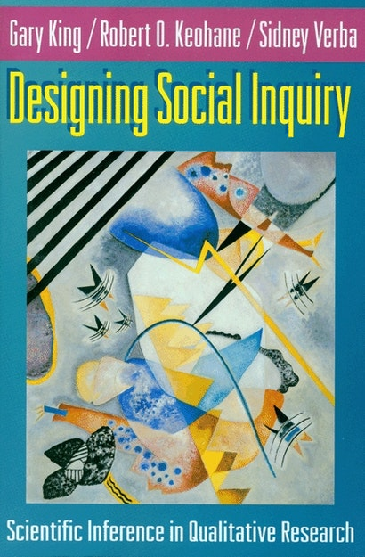

```{r setup, include=FALSE}
knitr::opts_knit$set(root.dir = rprojroot::find_rstudio_root_file())
```

## Plan for today

- What is science?
- What is political *science*?
- What is social science for?

## Political science as a science

Political science: the scientific study of politics \pause

What does it mean to study something "scientifically"? \pause

- Very contentious -- what science is and what science should be is an ever-evolving debate \pause
- e.g. we may disagree that political science is a science! \pause 
- [See Kerry and Massie](https://www.youtube.com/watch?v=8DSi2gzIkHM) \pause
- This course: learn methods and make your own assessment about the "science" in political science \pause

Definition by negation: Michael Moore

## Discussing "Bowling for Columbine" 

How scientific is Michael Moore's method? \pause

- What are the scientific elements? 
- What are the not-so-scientific elements? \pause

The good: 

- Longitudinal comparison in the US \pause
- Cross-national comparisons \pause
- Attempt to keep certain factors "constant" \pause

The bad: 

- No systematic data on keeping doors unlocked \pause
- Relative vs absolute gun violence \pause 
- Does not engage with prior work \pause 

## Science as rules-based 

King, Keohane and Verba [-@king_designing_1994]: "The content of ‘science’ is primarily the methods and rules, not the subject matter, since we can use these methods to study virtually anything."

{height=60%}

## KKV: Four characteristics

1. The goal is *inference*: "attempting to infer beyond the immediate data to something broader that is not directly observed." \pause
2. The procedures are public: "many [social scientists] proceed as if they had no method...Nevertheless they cannot help but use some method...If the method and logic of a researcher's observations and inferences are left implicit, the scholarly community has no way of judging the validity of what was done." \pause 
3. The conclusions are uncertain: science as provisional and always evolving \pause
4. The content is the method

## Principles of scientific research

Some principles (keep in mind these are contested) \pause 

- Empiricism: knowledge is derived from real-world observation \pause 
- Method: There are rules (more or less loose) for processing those real-world observations \pause 
- Objectivity: observation and interpretation is independent of the researcher's biases \pause
- Accumulation of knowledge: a community builds on one another's findings \pause
  
## Principles of scientific research

You may wonder whether this is achieveable in the social sciences \pause

There are a lot of complications...

- We disagree on the best way to measure a concept \pause
- We disagree on the proper method of analyzing data \pause
- Our biases can get in the way of our analysis...\pause
- And our biases almost certainly affects our choice of RQs! \pause
- Findings can be contradictory; the "body" of literature not coherent 

  - [Annual Review of Political Science](https://www.annualreviews.org/loi/polisci)

## A few presumptions

Empirical (social) science rests on a few philosophical presumptions \pause 

- We'll call this an **epistemology**: a belief about the nature of knowledge \pause 

Presumptions:

- There is objective truth that exists independently of the observer \pause
- There is order to the world: outcomes of interest are determined by causal forces which we can observe \pause 
- Following a particular method makes us more likely to establish truth \pause 

Learning about empirical methods will allow you to develop your own "epistemology"

## References {.allowframebreaks}

\footnotesize