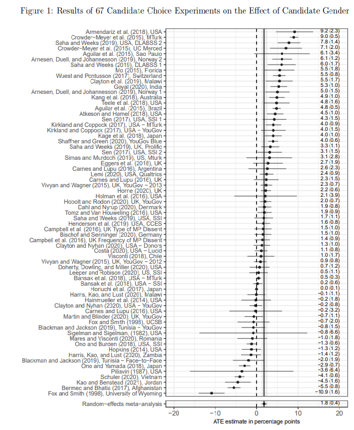
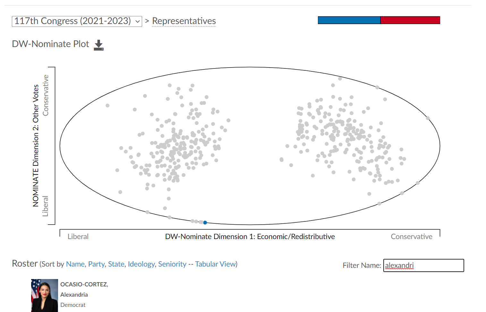
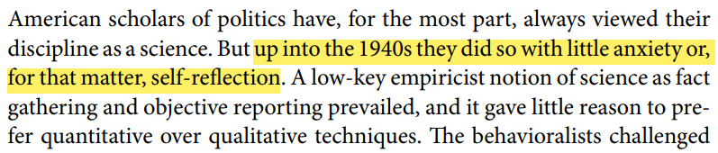

```{r setup, include=FALSE}
knitr::opts_knit$set(root.dir = rprojroot::find_rstudio_root_file())
```

## Plan for today

What we'll do: 

- What is science?
- What is political *science*?

What 

## Boring admin stuff

- Labs: start next week \pause
- Install R/RStudio \pause
- Change dates for Quiz 1? \pause  
- Course discussions: MyCourses + whatever you set up \pause 
- Office Hours: T 10-11; W 4-5; F 10-11
  - Zoom link on MyCourses; TAs' TBA
- Textbook: 4th edition + bookstore out of copies 
- Any questions?

## Clarifying expectations

2 types of readings:

- About actual methodological content 
  - Important, especially if content is both here and in lectures
- "Application" readings
  - For your broader understanding; more tangible 
  - I'm not going to ask specific questions \pause

Types of evaluations:

- Quizzes: objectively right or wrong, e.g. what are the three types of inference? Which of these statements is normative? 
- Midterm: for longer answers, e.g. is the scientific study of politics worthwhile? 
- Assignments: both correct code + demonstrate understanding 

## How to do well in this class

- Stay on top of things
- Can be difficult, so be strategic
- Think about what's actionable in terms of evaluation
- At the end of each reading/lecture:
  - Are you able to describe the main argument/takeaways in 2-3 sentences? 
  - If you had to name a handful of critical concepts, what would they be? 
- Don't lose the forest for the trees
  - There's a lot of superfluous information
  - Focus on the big picture 


## Political science as a science

Political science: the scientific study of politics \pause

What does it mean to study something "scientifically"? \pause

- Very contentious -- what science is and what science should be is an ever-evolving debate \pause
- e.g. we may disagree that political science is a science! \pause 
- [See Kerry and Massie](https://www.youtube.com/watch?v=8DSi2gzIkHM) \pause
- This course: learn methods and make your own assessment about the "science" in political science

## Some vocabulary

**Variable**: the observable characteristics of political phenomena that can take on more than one value \pause

**Dependent variable** (DV or Y): The phenomenon we seek to explain \pause

**Independent variable** (IV or X): The phenomenon that is expected to affect the DV \pause

**Hypothesis**: Formal statement of the relationship between DV and IV (+ direction of relationship) \pause

**Explanatory theory**: Story that justifies the hypothesis

## Definition by negation: Michael Moore

Start watching "Bowling for Columbine" at 42:50 and 1:17:12

## Discussing "Bowling for Columbine" 

Zoom poll after viewing clip \pause

- What is Moore's independent variable?
- What about his independent variable? \pause
- What is his method of gathering and analyzing evidence? \pause
- Overall, how scientific is Michael Moore's method?
  - What are the scientific elements? 
  - What are the not-so-scientific elements?

## Discussing "Bowling for Columbine"

The good: 

- Cross-national comparisons: good that he uses them! \pause
- Attempt to keep certain factors "constant" \pause

The bad: 

- No systematic data on keeping doors unlocked \pause
- Relative vs absolute gun violence \pause 
- Cross-national comparisons: not clear why the cases were chosen \pause
- Interviews: not clear why these people are relevant! \pause
- "The" cause? Acknowledge multicausal processes 

## Science as rules-based 

King, Keohane and Verba [-@king_designing_1994]: "The content of ‘science’ is primarily the methods and rules, not the subject matter, since we can use these methods to study virtually anything."

{height=60%}

## Principles of scientific research

Some principles (keep in mind these are contested) \pause 

- Empiricism: knowledge is derived from real-world observation \pause 
- Method: There are rules (more or less loose) for processing those real-world observations \pause 
- Objectivity: observation and interpretation is independent of the researcher's biases \pause
- Provisionality: knowledge is uncertain, always subject to revision and criticism \pause 
- Accumulation of knowledge: a community builds on one another's findings

You may wonder whether this can be achieved in the social sciences -- there are a lot of complications!
  
## Empiricism

Empiricism: knowledge is derived from real-world observation 

Problems?

- Our intuition is sometimes hard to tame!
  - Always ask yourself: what piece of empirical evidence would make me change my mind? 
  - Is the answer "none"? \pause
- We disagree on the best way to measure a concept
  - The "real-world observations" are not always lying there to be observed
  - The observation itself has to be constructed
  - Upshot: the "observation" you make may not be the same "observation" I make 

## Empiricism and intuition

[@schwarz_what_2021]

{height=85%}

## Empiricism and measurement

DW-NOMINATE: AOC as a moderate Democrat?


## Method

Method: There are rules (more or less loose) for processing those real-world observations

Problems?

- How "loose" must the rules be? 
  - Too loose: no common standard, potential for abuse
  - Too strict: restricts scientific creativity/personal preferences/heterodox approaches
- The data rarely "speaks for itself"!

## Objectivity

Objectivity: observation and interpretation is independent of the researcher's biases \pause

Problems?

  - Looking hard for a pattern that I think should be there
    - And not looking too hard when failing to find something I don't think should be there... \pause
  - My choice of research question is, necessarily, "biased" by my interests, normative commitments...
    - As well as the research topics I *don't choose* 
    
## Provisionality

Provisionality: knowledge is uncertain, always subject to revision and criticism \pause 

Problems?

- We are not good at dealing with and quantifying uncertainty! 
  - We want to know whether the vaccine "works" or "doesn't work"
  - Oftentimes, the answer is: it works some of the time, for some people, under some circumstances
  
## Accumulation of knowledge

Accumulation of knowledge: a community builds on one another's findings \pause

Problems?

- Findings can be contradictory; the "body" of evidence not coherent 
- Difficult to get a view of the literature as a whole

## A few presumptions

Empirical (social) science rests on a few philosophical presumptions \pause 

- We'll call this an **epistemology**: a belief about the nature of knowledge \pause 

Presumptions:

- There is objective truth that exists independently of the observer \pause
- There is order to the world: outcomes of interest are determined by causal forces which we can observe \pause 
  - Your textbook calls this "determinism" but I much prefer something like "regularity" 
- Following a particular method makes us more likely to establish truth \pause 

## Political science? Or "sociological gobbledygook"?

A lot of complications; peculiar philosophical presumptions!

- One option: give up
  - 538 article for this week: John Roberts calls the efficiency gap "sociological gobbledygook" \pause
  - Gobbledygook: "language that is meaningless or is made unintelligible by excessive use of abstruse technical terms" \pause
  - efficiency gap: actually not that complex!
  - [Short video on the efficiency gap](https://www.youtube.com/watch?v=IKtbfVmKM3w) \pause
- Other option: do the best we can and acknowledge how hard this is 
  - We have *no choice* but to engage with social scientific evidence
    - Gelman: "whatever we do, people will engage in social-science reasoning...the alternative to good social science is not no social science, it's bad social science."
    
## Science as socially-constructed

Note that we still don't have a definition of science...

- Get 100 scientists in a room and they wouldn't agree! \pause
- Early political scientists certainly thought they were doing science
- We do today -- but maybe we'll look stupid in 50 years! \pause
- Sartori [-@sartori_where_2004,p.786]: "Where is political science going? ...American-type political science...is going nowhere. Visit, to believe, the annual meetings of the American Political Science Association; it is an experience of unfading dullness. Or read, to believe, the illegible and/or massively irrelevant *American Political Science Review*."

## On the comparative nature of science

Something to keep in mind:

- "The question over the objectivity of the social sciences was framed from the start in a comparative form: ‘can the social sciences be as objective as the natural sciences?’ The comparison, in its turn, was premised on the belief  that the natural sciences are the better ‘sciences’." [@montuschi_scientific_2014, p.123] \pause

Are the natural sciences "better sciences"?

- Are the social sciences merely derivative of the natural sciences (i.e. the same but applied to a different object of study)? Or are they somehow different?

## Challenges we face

A peculiar challenge we face: questions about "the very existence of their [the social sciences'] subject matters." [@montuschi_scientific_2014, p.126] \pause

- Seems clear that gases, heat, molecules, planets, etc. exist *independent of our investigation of them*
- Does "alcoholism" exist independent of sociological studies of substance abuse? "The state"? "Inflation"? \pause

Another challenge: "individuals knowingly interact with the ways they and others are classified"

- The igneous rock doesn't care what it's called!
- A person cares whether they live in the "inner-city" or the ghetto!

## Scientific literacy

A goal of this course: scientific literacy

A difference between having the ability to *do* science and scientific literacy \pause

- "*use* the habits of mind and knowledge of science...to think about and make sense of many of the ideas, claims, and events they encounter in everyday life." [American Association for the Advancement of Science, quoted in @hill_scientific_2014]

Reading news articles, reading op-eds, debating with friends: apply a social-scientific lens

## BONUS: A short disciplinary history

Early days: science as "fact gathering and objective reporting."

[@fontaine_political_2010]

Empirical research was concerned with "densely descriptive reports on particular people, places, processes, events, or institutions, which were treated as innately interesting rather than as 'cases' of broader phenomena" [@sigelman_coevolution_2006, p.467]

Political science drew from law and history, more than the other social sciences 

## A short disciplinary history

1950s: Rise of quantitative techniques and surveys

- Pioneering studies in voting behavior and public opinion
- Quantitative methods are rudimentary -- means, cross-tabs...

1970s: Influence of economics and the rational choice framework 

- Quantitative work moves to multivariate analysis

1980s: the first experiments (Iyengar and colleagues on news media)

## Political science today

Increasing methodological sophistication 

- In economics: a "credibility revolution" [@angrist_credibility_2010]

Increasingly complex data collection 

Top PhD programs in the discpline have long methods sequences
- Often ~6 courses in PS depts + more in other depts!

Amidst all this...

- "we should never forget that methods are the tools we use when we do research, not the goal of our research, or our reason for being political scientists." [@rothstein_is_2005, p.8]

## References {.allowframebreaks}

\footnotesize