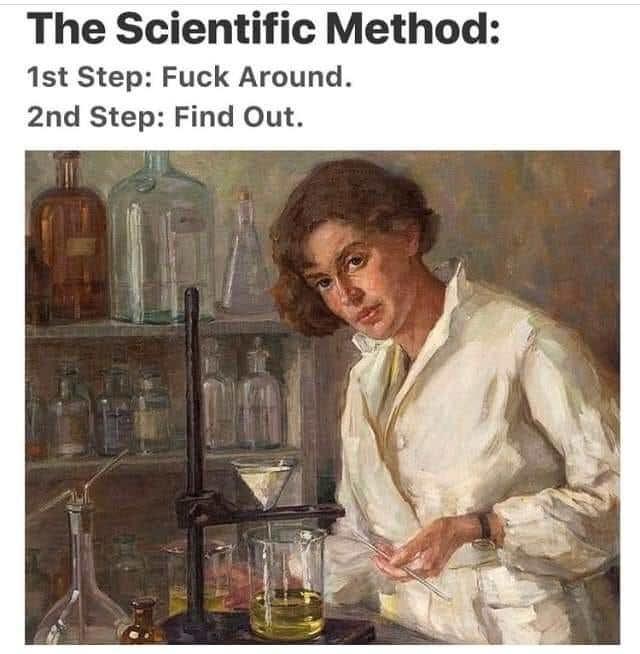
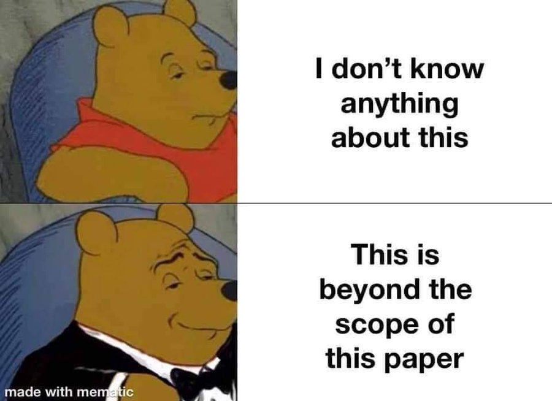

```{r setup, include=FALSE}
knitr::opts_knit$set(root.dir = rprojroot::find_rstudio_root_file())
```

## The scientific process

0. Familiarize yourself with the literature
1. Come up with a research question
2. Clarify the core concepts
3. Develop a theory
4. Derive hypotheses 
5. Find a suitable way to test hypotheses
6. Gather evidence and test the hypothesis
\pause

Each of these steps is an art of itself! 
\pause 

Important: this is an endless, iterative process!

- Results refine theory, which leads to more hypotheses, more tests...

## The scientific method



## 1. Find a research question

RQ: asks the "who, what, when or why" behind some phenomenon of interest \pause

- The "phenomenon of interest" is our **dependent variable** \pause 

Examples:

- Does candidate gender affect vote choice? \pause
- Why do countries sign trade agreements that limit their ability to impose tariffs? \pause
- How did Barack Obama's election in 2008 change Americans' racial attitudes? \pause

The RQ can be fairly broad; we don't have a clear hypothesis yet

## 1. Find a research question

How do we find a research question? 

- Relevance: some things are important to explain! \pause
  - e.g. vaccine hesitancy in current times
  - we want to be able to explain it, predict it, influence it \pause
- A puzzling situation \pause
  - Most people say they favor free trade, yet barriers to trade are immense; why? \pause
- Exploit a deviant case \pause
  - Duverger's Law and Canada's party system
  
Karl Popper: "there is no such thing as a logical method of having new ideas...Discovery contains an 'irrational element,' or a 'creative intuition.'"

## 2. Clarify the core concepts 

Gerring [-@gerring_social_2011,p.112]: "the most basic question of social science research: what are we talking about?"

When did the US become a democracy? \pause

We can all agree on:

- When the US gave propertied adult men the right to vote \pause

- When female suffrage was adopted \pause

- When the Voting Rights Act was adopted \pause

But we may disagree on whether these are *necessary* conditions for democracy! \pause

Justice Potter Stewart in *Jacobellis v. Ohio*: "I know it when I see it" re: obscenity -- we want a better standard!

## 3. Develop a theory

Theory: a set of logically related propositions that help explain an outcome. 

- The theory provides **mechanisms** that explain how/why DV and IV are linked \pause

Say you're interested in the link between attending Harvard and career earnings; potential theories? \pause

- Harvard makes you a more productive/skillful employee \pause
- You make connections at Harvard \pause
- You got into Harvard because you were already better \pause

These are **observationally equivalent**, i.e. we may all believe in the link Harvard -> earnings, but diverge on the *why*

- Ideally, each theory has *testable implications*

## 3. Develop a theory

Two approaches:

- Inductive: a bottom-up process that begins with empirical observation and attempts to generalize from them 
  - Observation \rightarrow Pattern \rightarrow Tentative hypothesis \rightarrow Theory \pause
  - Often more *exploratory* in nature -- when we don't know how to approach RQ \pause
- Deductive: a top-down process that begins with an established theory and draws on observations to test the theory
  - Theory \rightarrow Hypothesis \rightarrow Observation \rightarrow Confirm/Falsify \pause
  - Often more *confirmatory* in nature

## 4. Generating hypotheses 

The hypothesis formally states:

- The relationship between two concepts \pause
- The direction of the relationship \pause
- The unit of analysis -- what is one "case" \pause

In addition, your hypothesis must be **falsifiable**

- It must be possible to prove that it is false \pause
- Examples? \pause
- There lives a white gorilla on Mount-Royal \pause
- Bertrand Russell: "If I were to suggest that between the Earth and Mars there is a china teapot revolving about the sun in an elliptical orbit, nobody would be able to disprove my assertion provided I were careful to add that the teapot is too small to be revealed even by our most powerful telescopes."

## 4. Generating hypotheses: quote on falsifiability

"It is comforting that the finest minds in science are as prone as the rest of us to bitching. But the theoretical physicist Wolfgang Pauli (1900-1958) is in a category of his own: the withering comment for which he's best known combines utter contempt on the one hand with philosophical profundity on the other. 'This isn't right,' Pauli is supposed to have said of a student's physics paper. It's not even wrong.'"

[Source: see this Guardian article](https://www.theguardian.com/science/2005/sep/19/ideas.g2)

## 5. Find a suitable way to test your hypotheses

Now that we have a hypothesis, we need to find a way to test it

- We want to find a suitable *research design* \pause
- Not all research designs suit all questions \pause
- We'll see some research designs later in the course!

## 6. Gather evidence and test hypothesis

The empirical evidence can be: interviews, survey data, country-level statistics, election results, historical records...

The purpose is to test your hypothesis to see if it is supported by the data

- We are working to disprove the **null hypothesis**
- The null states that IV and DV are not related to one another 
- If we find evidence that is (very) inconsistent with the null hypothesis, we **reject the null hypothesis**

## 7. Other steps

Reflect back on your theory and refine it \pause
Communicate the results \pause
Replicate the results (in other contexts, with different empirical strategy...) \pause

Words of wisdom once you have your results:
 
- Make careful statements based on strength of evidence
  - Are the results merely "consistent with" the theory? Or something more? \pause
- Consider strength of evidence as a continuum 
  - A theory is not either "true" or "debunked" \pause
- Think about accumulation of evidence 
  - Your study is just a small drop in an ocean of scholarship 

## A note on qualitative vs quantitative approaches

- One is neither more nor less rigorous than the other \pause
- One is neither more or less empirical than the other \pause
- But one may be better suited to a given situation/RQ \pause

Quantitative: large-N, aims for breadth and generalization
Qualitative: small- and medium-N, in-depth look at cases 

People tend to take sides in this debate... \pause

- I want you to keep an open-mind \pause
- You can have a preference! But we want to be conversant in both \pause

Leo Strauss: "Nevertheless one may say of it [quantitative political science] that it fiddles while Rome burns. It is excused by two facts: it does not know that it fiddles, and it does not know that Rome burns." [quoted in @bond_scientification_2007, p.897]

## How a scientist behaves

- Acknowledge uncertainty \pause
- Think probabilistically \pause 
- Consider alternative explanations \pause
- Acknowledge complexity of multicausal processes \pause
- Convey provisional nature of findings \pause 
  - "Further research should..." \pause
  - Also helps you avoid to do the work yourself if lazy ;)

## "Beyond the scope"



## What makes for credible research? 

No clear demarcation between good and bad empirical research \pause

Keep in mind: a single finding/study is scarcely enough \pause

Hallmarks of credible research: \pause

- Clearly defines concepts \pause
- Clearly outlines the assumptions made \pause
- Clearly describes measurement of key concepts \pause
- Considers contradictory evidence and engages in good faith \pause 
- Transparent data collection and analysis 

## Improvements in transparency


## Wrapping up this week 

What you should know:

- Key terms: independent/dependent variable, hypothesis, inductive/deductive theory-building, falsifiability
- You should be asking yourself:
  - What distinguishes science from non-science? 
  - What distinguishes the natural sciences from the social sciences? 
  - How close to the scientific ideal is political science?
  

Questions?

## References {.allowframebreaks}

\footnotesize