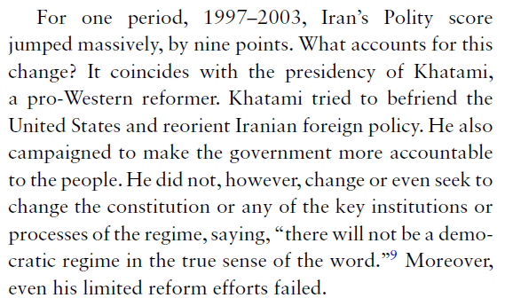
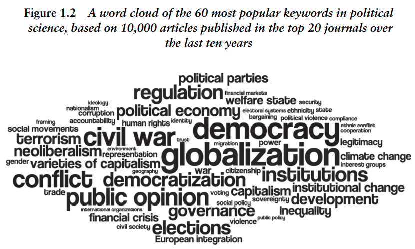

```{r setup, include=FALSE}
knitr::opts_knit$set(root.dir = rprojroot::find_rstudio_root_file())
```

## Boring admin stuff

- WhatsApp chat: not monitored! 
- Labs start this week -- you must have R installed!
- Assignment 1 (filling in survey): will be available shortly
  - Due September 20th, 11:59PM
  - Make sure to input student ID correctly!
- OH: in person or on zoom?
  - Chris: Tuesdays 1-2pm
  - Marion: Wednesdays 10:30-11:30am
  - Irene: Fridays 11:30-12:30
  - Danielle: Fridays 1:30-2:30pm
- Workshop on Thursday

# Scientific literatures
## What is a scientific literature? 

The accumulated body of theory and evidence related to a research question \pause

- This is totally socially constructed! \pause
- You and I may have a different reading of "the literature" \pause
- There are competing theories; competing empirical approaches; even competing scholars!

A research paper outlines what people have said previously... \pause

And makes clear what its **contribution** is 

- B&A, p.27: "the author is making an argument that her research fits into the larger body of literature but is still unique."

## What's a contribution? 

- "We don't know if finding X holds in such a place at such a time"
  - The "Michigan school" of voting behavior and claims that party identification does not travel to Canada [@leduc_partisan_1984] \pause
- "People have argued X before, but not using this more convincing method/better data"
  - Weaver and Lerman [-@weaver_political_2010] on the "political consequences of the carceral state" vs Gerber et al. [-@gerber_does_2017] \pause
- "Previous research implies X, but it's never been tested" \pause
  - e.g. applying theories from political theory: Carole Pateman on participatory democracy -- the individual qualities and attitudes necessary for democracy to work can only be developed through democratization of all authority structures
- "Theory X does not seem to work in situation Y; why?"
  - Allison [-@allison_conceptual_1969] on the Cuban Missile Crisis
  
## How do academic literatures evolve?

The literature on the "democratic peace"

- DPT: Democracies never/rarely go to war with one another \pause
- Levy [-@levy_domestic_1988, p.662]: "This absence of war between democracies comes as close as anything we have to an empirical law in international relations." \pause
- And yet...30 percent of IR scholars disagree with the DPT! [@imai_robustness_2021] \pause

We have our hypothesis: 

- As democracy (IV) increases...
- warmaking (DV) decreases \pause
- Stated more clearly: "As a dyad becomes more democratic, the probability that the countries composing the dyad go to war with one another decreases."

## How do academic literatures evolve? 

What are we missing? 

- A **theory** that explains the **causal mechanisms** \pause
  - Maoz and Russett [-@maoz_normative_1993] propose two mechanisms
  - Normative: "norms of compromise and cooperation"
  - Structural: "institutional constraints" make warmaking more costly/complex for leaders of democracy countries \pause
- **Clear concepts**: What's a democracy? What's a war?
  - What does "democracy" mean? Our theory informs how democracy should be conceived! \pause
- **Measurement**: How will we actually measure our concepts? 
  - A popular index of democracy: Polity scores 
  - Not without its problems...
  
## And then the critiques flow in...

Might there be something that is related to both democracy and war and that would explain away the association?

- Cold War interests, capitalism, economic development, sufragette movement, trade relations...
- For each of these, we want to develop a theory and derive **testable implications**

Is our measurement any good? 

- Measurement is only as clear as the concepts are \pause
- Western bias in measurement? 

## Western bias? 



[@colgan_american_2019]

## What does DPT say about the scientific process? 

A few lessons:

- We need to have a good theory
  - Data alone cannot rescue us! \pause
- The social world is complicated!
  - It's possible that many of these explanations have some truth to them \pause
- Critiques improve the literature
  - Ever-evolving science \pause
- Despite all this work, highly-trained scholars still disagree
  
## How your paper relates to the literature

Example: Baccini et al. [@baccini_covid-19_2021]

- The research question: what was the effect of COVID-19 on the 2020 presidential election in the US?
- County-level analysis that relates covid cases and Trump vote \pause
- Finding: Trump would have won the election had covid cases been 5% lower! \pause
- Seems pretty narrow...But Baccini et al. argue their findings have much more to say about politics! \pause
  - Literature on retrospective voting: do voters punish/reward incumbents based on past performance? \pause
  - Literature on "shocks": what happens when negative events out of the incumbent's control occur? \pause
      - College football losses... [@healy_irrelevant_2010]
      - Shark attacks... [@fowler_shark_2018]

## How do I find literature?

We'll see more on Thursday during the workshop
  
Literature reviews that already exist: 

- Annual Review of Political Science
- Oxford/Cambridge/etc. Handbooks
- Lit review section from relevant articles \pause

For the most part, problem of abundance, not dearth

- The challenge is to *synthesize* into a coherent whole \pause
- Use cognitive shortcuts! You can't read everything

## Academic journals

Broadly, two types:

- "Generalist"
  - American Journal of Political Science, Journal of Politics...\pause
- "Subfield"
  - International Organization, Political Behavior...\pause
  
Journal "rankings" 

- Not all journals are equally "prestigious"; 
- There are metrics that quantify the influence of a journal -- e.g. "h-index" \pause
  - See here: [Google scholar's top publications](https://scholar.google.ca/citations?view_op=top_venues&hl=en&vq=soc_politicalscience)
- Lower-ranked journals are not necessarily bad!

## Publication bias

**Always** read "the literature" with a critical eye

Publication bias: outcome of study influences Pr(publication) \pause

- Most often: "null results" mean no publication \pause
- "file-drawer problem" \pause
- Incentive for researchers: keep looking until you find something! \pause
- Evidence of this in PS: Gerber et al. [-@gerber_publication_2010]
- Result: 
  - 20 studies find no effect of X on Y
  - 1 study finds effect of X on Y
  - That one study is published, the other 20 are not
  
## Solutions to publication bias

- Tolerance of null results
  - Sometimes, there really is no effect of X on Y! \pause
- Transparency: publish data and code
  - Others can analyze your data and criticize \pause
- Pre-registration (now obligatory at JoP!)
  - The idea: before collecting data, say exactly how you'll analyze the results 
  - Going even further: registered reports

## BONUS: What do political scientists study? 



Toshkov [-@toshkov_research_2016, p.15]

## References {.allowframebreaks}

\footnotesize