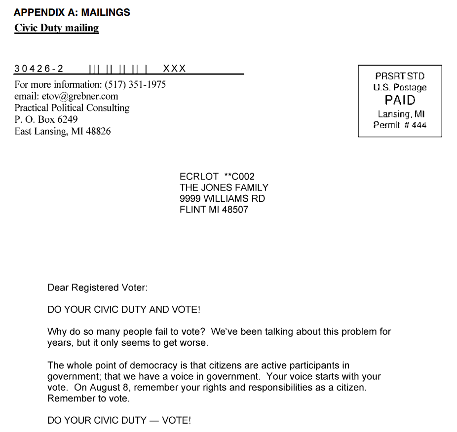
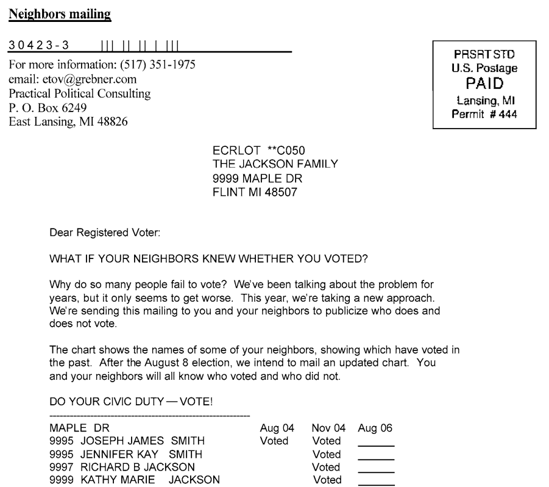
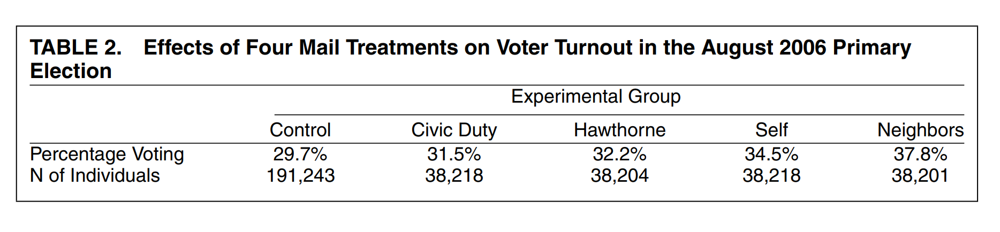

```{r setup, include=FALSE}
knitr::opts_knit$set(root.dir = rprojroot::find_rstudio_root_file())

library(knitr)
```

## Boring admin stuff

- Assignment 2 is out -- start early!
  - Post questions on discussion board (error messages helpful)
- RMarkdown video
- Grades for assignment 1 are out
- TEAM mentors

## The problem

If we allow units to **self-select** into the treatment, we end up with a problem

- The units that choose the treatment are systematically different 
  - People go to the hospital because, if they didn't, they would be very sick
  - Students come to OHs because they're interested in the content
    - If they didn't come to OHs (counterfactual), they would probably do well regardless
- In terms of POs...
  - The potential outcome under control for those who self-selected into the treatment is different, on average, than the potential outcome under control for those who self-selected into the control 
  
## The solution

To avoid this problem, we use **random assignment** of the treatment; we'll call this an **experiment**

- Units no longer self-select into treatment \pause
- The researcher "decides" who gets the treatment
  - By "decide" we mean: randomly choose who gets treatment \pause
- What does this do? Any ideas? \pause
- It solves the selection bias \pause
  - On average, treated and control units should be very similar \pause
  - Intuitively: there is nothing dissimilar between the treated and control units, *except* for the application of treatment \pause
    - Hence, if there is a difference in outcome between the two groups, it must be because of the treatment \pause
  - In terms of POs: had the treated units not been treated, their outcome would be the same, on average, as the control units 
  
## Randomization and the FPCI

Have we solved the FPCI? \pause

- Well, we still can't observed both POs for any given unit \pause
- But we've constructed a plausible **counterfactual**
- We are able to say:
  - I can't see $Y_i(0)$ for the treated units \pause
  - But if I can assume that it is the same as $Y_i(0)$ for the control units \pause
  - Which we do observe! 
  
## Randomization example

Gerber, Green and Larimer [-@gerber_social_2008] are interested in the motivation to vote 

- A long tradition in political science considers voting as individually irrational 
- What's the benefit of voting?
- What's the cost of voting? 

Pr(Voting) = P*B - C + D

## Randomization example

Context: 2006 primary elections in Michigan 

- In the US, voting records are public 
- Mailers to about 180,000 households
- 5 conditions:
  - Control: $Y_i(0)$
  - "Civic Duty": $Y_i(Civic Duty)$
  - "Hawthorne": $Y_i(Hawthorne)$
  - "Self": $Y_i(Self)$
  - "Neighbors": $Y_i(Neighbors)$
- Outcome $Y_i$: whether subject voted (1/0)

## Randomization example: Civic duty condition

{height=95%}

## Randomization example: Neighbors condition

{height=90%}

## Randomization example: the data

\footnotesize

```{r}
voting <- read.csv("lectures/lecture_4.2/gerber.csv")
cols <- c("female", "yob", "voting", "hawthorne",
          "civicduty", "neighbors", "self", "control")
voting <- voting[,cols]
kable(head(voting))
```

## Randomization example: the data

\footnotesize

```{r}
dim(voting)
table(voting$voting)
```

## Randomization example: Turnout in the control

\footnotesize

```{r}
voting_control <- voting[voting$control==1,] # subsetting the data
mean(voting_control$voting) # mean of dummy = proportion
```

\pause
What's your hunch as to the size of the treatment effect? 

## Randomization example: The results



Who wants to interpret this? \pause

- "Direction": Positive or negative effect? \pause
- "Magnitude": How large is the effect? 
  - Domain expertise is important in contextualizing
  - Do you think this is a large effect? \pause
- Can be interpreted causally? 

## Randomization example: Causal effect?

 

Who wants to try to interpret this? \pause

- Randomization "works" $\leadsto$ groups are the same
  - The same in terms of POs under control (can we confirm?) \pause
  - And the same in terms of **pre-treatment covariates**
    - Pre-treatment covariate: a variable that is not/cannot be affected by the treatment 

## Experimental vs observational 

In **experimental research**...

- The researcher has control over the treatment assignment mechanism \pause
- Specifically, units are randomly assigned to different experimental conditions \pause

In **observational research**...

- The researcher gathers data on the units without having influence on treatment assignment \pause
- Units self-select into different values of the treatment/IV
- More about this later

## Internal and external validity 

Experimental and observational approaches are often compared in terms of validity

- **Internal validity**: The more plausible the claim about causality, the higher the internal validity \pause
- **External validity**: The results of the study can be *generalized* to the real world or beyond the case at hand
  - Remember: *generality* is an important scientific principle \pause

## Different types of experiments

- Lab experiment: The "classic" experiment. Units are brought to the "lab", a controlled environment where the study takes place
  - More common before the Internet!
  - Advantage? Disadvantages? \pause
- Field experiment: takes place "in-the-field"
  - "aim to reproduce the environment in which the phenomenon of interest naturally occurs" Gerber [-@lupia_field_2011, p.116] \pause
  - Peyton et al. [-@peyton_field_2019]: community policing and perceived legitimacy of police
  - Wantchekon [-@wantchekon_clientelism_2003]: randomly assigns clientelist policy platforms
  - Advantages/disadvantages? \pause 
- Survey experiment: embedded in a survey
  - e.g. randomly assign "global warming" or "climate change" 
  - Advantages/disadvantages? 

## Why not randomize everything?

If randomization is so powerful, why not randomize everything? \pause

- There are some things we just can't randomize!
  - Either for ethical reasons -- e.g. smoking
  - Or for more fundamental reasons -- did civil rights protests in the 1960s influence vote choice? [@wasow_agenda_2020] \pause
- Experiments sometimes have limited external validity 
  - Iyengar et al.'s [-@iyengar_experimental_1982] lab experiments on media effects 
  
Still useful to think about the "experimental ideal"

- If I *could* conduct an experiment, what would it look like?  \pause

And look for randomness inherent to the world 

## Butler and Broockman

- What sort of experiment do they conduct? 
- Internal and external validity? 
- What do they conclude, and how convincing is it?
- Any drawbacks to their design? 
  
## The search for quasi-experiments

Our last type of experiment: quasi-experiments/natural experiments \pause

- Except it's not really an experiment! 
  - The researcher does not have control over the treatment assignment mechanism \pause
- Instead, we'll say the treatment is **as-if random** \pause
- No one randomized the treatment
- Instead, "nature" took care of that for us \pause

Examples of randomness we could exploit? \pause

## Some examples of randomness we can exploit

- What is the effect of judge's personal circumstances on their decisions?
  - Having a daughter: causes more feminist decisions by US judges [@glynn_identifying_2015] \pause
- What is the effect of socio-economic status on attitudes toward redistribution? 
  - Lottery winners and attitudes toward redistribution [@doherty_personal_2006] \pause
- What is the effect of enrolling in the army on political attitudes?
  - The Vietnam draft lottery [@erikson_caught_2011] \pause
- Do autocratic regimes depend on their leaders?
  - The success or failure of assassination attempts and future democratization [@jones_hit_2009] \pause

## Observational research

We frequently can't randomize or find a quasi-experiment 

- So we are left with observational data
- Observational data is not useless -- far from it!
- But it can be harder to establish causality

The typical problem: spurious relationships

- An observed relationship between x and y, but not a *causal* one
- Why? The relationship is **confounded** by some variable z
  - Z *confounds* the relationship between x and y if it is correlated with both
- These spurious relationships show up a lot in observational research
  - They can trick you into thinking there's a causal effect -- even when there's not! 

## Examples of spuriousness

- Correlation between sleeping with shoes and waking up with a headache 
  - What's a potential confounder here? \pause
  - Being drunk! \pause
- Any other examples? \pause

The total observed association between X and Y is: a mixture of causal and confounding association

- Once I "control" for z, there may be no relationship between X and Y
- Once I "control" for z, the relationship between X and Y may be weaker 
- Once I "control" for z, the relationship between X and Y may change direction 

## Many sources of spuriousness

The problem with observational research is that there may be many such z variables!

- i.e. many variables may confound the relationship between x and y 
- In which case, to recover the true causal effect, I would need to "control for" all of these confounders \pause

Let's think of the example: office hours -> grade in the class

- What are some potential confounders here? 

## Is this class causing better outcomes? 


## Concluding our section on causality

Main takeaways:

- The FPCI makes things difficult; adjust confidence accordingly!
- A lot of observed correlations are non-causal
- Randomization "solves" the selection problem and makes inferring causality much easier
- But not always possible! So look for randomness inherent to the world
  
## References {.allowframebreaks}

\footnotesize