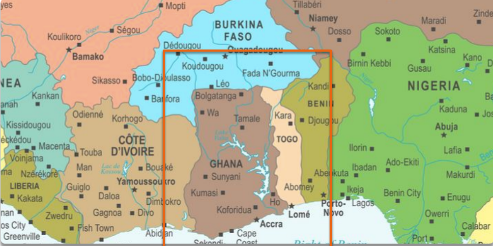

```{r setup, include=FALSE}
knitr::opts_knit$set(root.dir = rprojroot::find_rstudio_root_file())
```

## Boring admin stuff

- Assignment 3 due on Monday October 25th, 11:59pm
  - See email for OH and tutoring 
- Quiz 1 from the 25th to the 27th
  - How to prepare: review lecture slides 
- UNICEF fundraiser: make me dress up for Halloween 

## The comparative method

- The comparative method: select a few cases and compare them
- How many cases? From 2 to roughly 10
- But not too many because the benefit of this method is in-depth knowledge of the cases
- Two designs:
  - Most-similar-systems design (MSS)
  - Most-different-systems design (MDS)

## The Most-Similar Systems design

What is the Most-Similar-Systems design? 

- Select cases that are:
  - Similar in terms of many potential confounders/IVs
  - But different in terms of the outcome (DV)
- This "controls for" the confounders by holding them constant
- The question is then: what explains the difference in outcome? 
  - We look for a variable that differs between the cases
  
## The MSS design: why is Ghana more democratic than Togo? 


Ghana's Freedom House score (2019): 83/100

Togo's Freedom House score (2019): 43/100

## The MSS design: why is Ghana more democratic than Togo? 

\footnotesize 

```{r,echo=FALSE,message=FALSE,warning=FALSE}
library(dplyr)
library(knitr)
library(kableExtra)
togo <- tribble(~Variable, ~Togo, ~Ghana,
        "Climate", "Hot", "Hot",
        "Income", "Low", "Low",
        "Ethnic diversity", "Heterogenous", "Heterogenous",
        "Largest religion", "Christian", "Christian",
        "Other religions", "Islam, Traditional", "Islam, Traditional")
kbl(togo, booktabs = TRUE) %>% 
  kable_styling(latex_options = "striped")
```

\pause
\small

- We think of climate, income, diversity, and religion as potential *confounders* \pause
- In an observational (non-experimental) setting, the causal relationship between $X$ and $Y$ can only be uncovered if we adjust for confounders 
- In the case of comparative method, "adjusting for" means finding a case with similar values of the confounder 
  - Ethnic diversity cannot explain the difference in outcome (democracy score), because it's the same in Ghana as in Togo \pause
- The question: what *is* different between Ghana and Togo? 

## The MSS design: why is Ghana more democratic than Togo? 

\footnotesize 

```{r,echo=FALSE,message=FALSE,warning=FALSE}
library(dplyr)
library(knitr)
library(kableExtra)
togo <- tribble(~Variable, ~Togo, ~Ghana,
        "Climate", "Hot", "Hot",
        "Income", "Low", "Low",
        "Ethnic diversity", "Heterogenous", "Heterogenous",
        "Largest religion", "Christian", "Christian",
        "Other religions", "Islam, Traditional", "Islam, Traditional",
        "Colonizer", "France", "United Kingdom")
kbl(togo, booktabs = TRUE) %>% 
  kable_styling(latex_options = "striped") %>% 
  row_spec(6, color = "white", background = "#D7261E")
```

\pause
\small 

- This is a highly stylized demonstration!
- We would want more precise measurement (not just "hot" or "low"!)
  - So we are convinced the confounders have truly been accounted for \pause
- We would also want an account of how $Colonizer$ \rightarrow $Regime$
  - Benefit of small-N research is to know the cases in depth
  - How did the British rule Ghana? How did they come to leave Ghana? 
  - In short: what is the causal *mechanism*?

## The MSS design: weaknesses

\small 

What do you think? Any weaknesses? \pause

- Views causality as a deterministic process
  - If $X$ is present, then $Y$ necessarily behaves in such and such a way -- for all units
  - Generally better to think of causality as a probabilistic phenomenon
    - If $X$ is present, $Y$ is *more likely to* behave in such and such a way \pause
- We tend to measure confounders very roughly
  - e.g. "High" or "Low" ethnic diversity
  - The more complicated the operationalization, the harder it is \pause
- Can be hard to account for all confounders 
  - Especially given the small N
  - Unlikely to find two cases that are exactly the same on all relevant confounders, except for the IV of interest

## Most-different-systems design

- Selects cases that are: 
  - Very different in terms of independent variables
  - Yet very similar in terms of outcome
  - By finding one independent variable that is the same across cases, we can point to it as the cause of the outcome
    - But not very convincingly -- see later
  - By saying that $X_1, X_2, X_3...$ are all different between the two cases despite the similar $Y$, we can show that the X's are not *necessary* conditions for $Y$ to occur 
  
\footnotesize

\begin{longtable}{llll|l|l|}
\hline
Country & Pop. density & Colonized? & Wealthy? & Political system? & Populist parties? (DV) \\ \hline
\endfirsthead
%
\endhead
%
A       & High         & Yes        & No       & Federal           & Yes                    \\ \cline{5-6} 
B       & Low          & No         & Yes      & Federal           & Yes                    \\ \hline
\end{longtable}
  
## Selecting on the dependent variable 

In the MDS design, the DV does not vary by construction

- You select cases that have the same $Y$
- What's the problem? \pause
  - Imagine we were to study the causes of death
  - One approach: select on the DV and study *only people who have died*
  - Can we find something they have in common? 
    - They all drank water!
    - But the people who have *not* died also drank water...
    - But we don't see that, because we didn't include them in our sample \pause
- This is at the heart of Geddes' critique of Theda Skocpol
  - Skocpol is interested in the causes of revolutions
  - She studies countries in which revolutions occured -- France, China, and Russia 
  - She finds what the countries had in common: external threat 
  - What she doesn't see are all cases of countries under external threat that did not undergo a revolution 
  
## Michael Moore's Bowling for Columbine 

What flavor of the comparative method does Michael Moore (implicitly) use?

Do you find it convincing? Why or why not? 

- If you find it convincing: what evidence would convince you it's wrong? 
- If you're not convinced: what more do you need to see in order to be convinced? 

## Purposive sampling

Why not identify a universe of relevant cases and sample randomly? 

- The benefits of randomization are "lost" in small samples
  - If I randomly select 100 of you into group A and another 100 into group B, chances are the groups will be very similar on average
  - But if I select just one of you into each group, very unlikely I'll get similar people
- As in case studies, we believe some cases give us more leverage over our research question
  - Specifically, selecting cases based on similarity/difference 
- Practical considerations: I know some of the cases much better than others! 
  - We want detailed description of processes and events
  - I certainly couldn't tell you much about Togo (though I could include it in a statistical model)