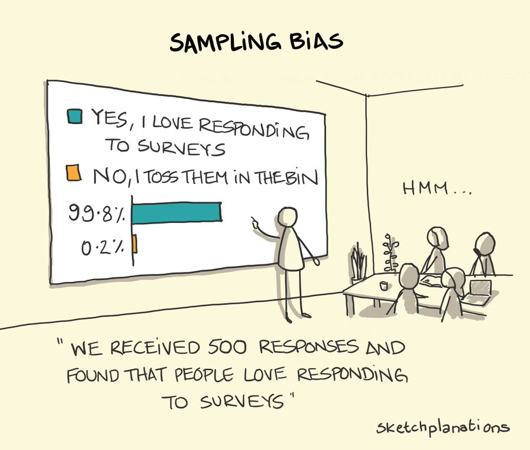
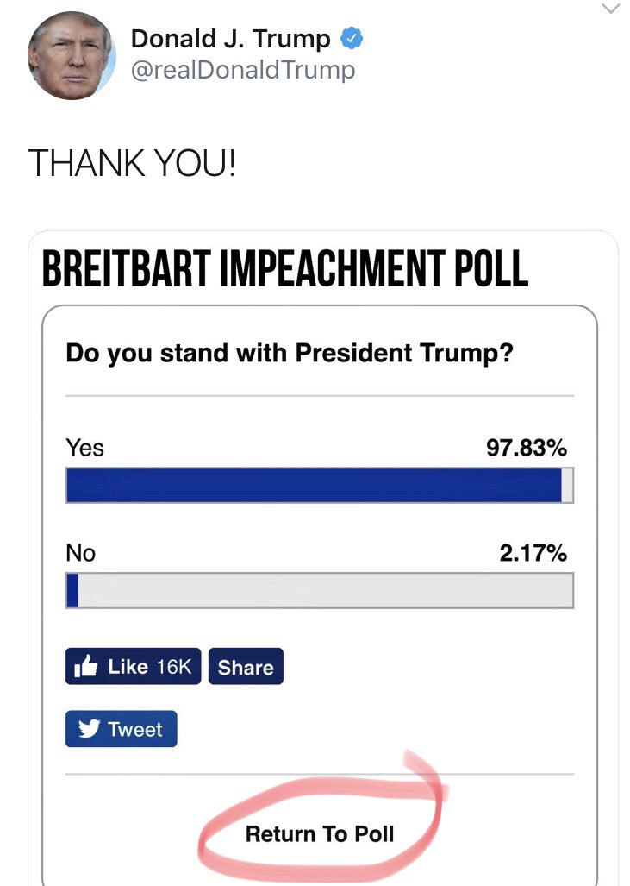
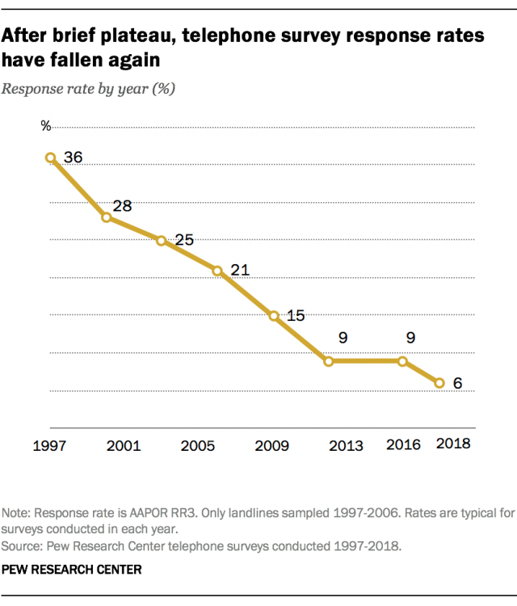

```{r setup, include=FALSE}
knitr::opts_knit$set(root.dir = rprojroot::find_rstudio_root_file())
```

## Boring admin stuff

- Assignment 3: due next Monday 
- Office hours after class 
- Quiz 1 next week 
- Midcourse survey 
- [Halloween fundraiser](https://tinyurl.com/46z7bsv3)

## What are surveys useful for? 

- Gaging public opinion 
  - Berinsky [-@berinsky_measuring_2017]: "in effect polls have become public opinion."
- Feedback on programs and policies
- Understanding the evolution of society 

\centering
{height=40%}

- Evaluating relationships between different attitudes/experiences 

## A short history of polling 

First issue of *Public Opinion Quarterly*:

- "an essay...explaining how George Gallup's quota-controlled survey of a few thousand triumphed over the *Literary Digest*'s straw poll of millions in correctly predicting the election outcome [of 1936]." Hillygus [-@hillygus_evolution_2011]
- "Sampling bias": the people who are included in the survey are systematically different than the people who are not 
  - Same as "selection bias": you can't solve it by increasing sample size!

The rise of survey research in political science: 

- "Between 1950 and 1970, the percentage of articles in the APSR based on surveys went from 0 to almost 50 percent." [@fontaine_political_2010, p.81]

## Some basic concepts

- Population: All possible units of interest. 
  - If I want to predict the election outcome, the relevant "population" is all Canadian citizens aged 18 or over
  - If I want to gage your interest in the class, the "population" is all 281 of you registered in the course
- Sample: A subset of the population that I contact
  - Key question: is it *representative*? 
- Parameter: A number that describes a characteristic of our population
  - e.g. the mean height in this class 
- Statistic: A number that describes some aspect of our sample
  - e.g. mean height of students in the sample 

We use the data from our sample to make **inferences** about population parameters
         
## The (often unattainable) gold standard

Ideally, our sample is the same as the population!

- This makes things easy: every unit in the population is in the sample, and no unit that is not in the population is in the sample 
- Here, sample statistics = population parameters
- An example: the census, "big data"
- BUT resource-intensive, particularly in large populations 
  - e.g. barely 30 years ago, if I wanted to survey this class, each additional respondent would require an interviewer

Instead, construct a **sampling frame** and randomly sample from it 

- Sampling frame: Enumeration (listing) of all units eligible for sample selection
- e.g. list of 281 students and randomly select 20

## Probability sampling: the gold standard in sampling 
Probability sampling: every unit in the population has non-zero probability of being selected into sample 
  
- If we have a perfect sampling frame...
- Get to randomly choose who to interview...
- And everyone contacted agrees to be interviewed...
- Our sample is representative (ON EXPECTATION)
- On expectation? 
  - If I draw 1,000 samples, *on average*, the samples will be representative 
  - But some samples will be a bit older than the true population parameter
  - Some younger, some more male...
  - **Sampling variance**
  
But, you guessed it...this is unlikely! 

## Sampling frame: the classlist

\footnotesize

```{r}
survey <- read.csv("assignments/pset1/class_survey.csv")
head(survey)
# sampling one random number from 1 to 10
sample(1:10, size = 1)
# sampling 10 random numbers from 1 to 100 (w/ replacement)
sample(1:100, size = 10, replace = TRUE)
```

## Sampling frame: the classlist

\footnotesize

```{r, include=FALSE, echo = TRUE}
library(dplyr)
```


```{r}
order <- sample(1:nrow(survey), size = nrow(survey),
                replace = FALSE)
order[1:5]
sample_n5 <- survey[order[1:5],]
sample_n5
c(mean(sample_n5$ideology, na.rm = T), mean(survey$ideology, na.rm = T))
```

## Let's draw a few samples...

\footnotesize

```{r,echo=FALSE, fig.show='animate',warning=FALSE,message=FALSE,interval=1/10}
ideo <- na.omit(survey$ideology)[1:200]
df<-data.frame(ideo,sample=rep(1:10,each=20))
df2<-aggregate(ideo~sample,df,mean)
df<-cbind(df,mean_loc=rep(df2$ideo,each=20))

library(gganimate)

ggplot(df,aes(x=ideo, group=sample,frame=sample)) +
  geom_histogram() +
  geom_vline(aes(xintercept=mean_loc,frame = sample),color="red", size = 1.5)+
  labs(title = 'Sample: {closest_state}') +
  scale_x_continuous(breaks=seq(0,10,1))+
  theme_classic()+
  transition_states(
    sample,
    transition_length = 0.4,
    state_length = 1.5
  )+enter_fade() + 
  exit_shrink()
```

## Central limit theorem from class survey

\scriptsize

```{r, message = FALSE, warning=FALSE,echo=FALSE}
sample_mean_20 <- matrix(nrow = 1000, ncol = 1) %>% as.data.frame() %>% rename(sample20 = V1)
for(i in 1:1000){
  sample_mean_20[i,] <- survey[
    sample(1:nrow(survey), size = 20, replace = FALSE),
  ]$ideology %>% mean(na.rm = T)
}
sample_mean_20 <- sample_mean_20 %>% as.data.frame()
library(extrafont)
ggplot(sample_mean_20,
       aes(x = sample20)) +
  geom_histogram(col = "black",
                 fill = "steel blue") +
  geom_vline(xintercept = mean(survey$ideology, na.rm = T), col = "red", size = 1.2) +
  theme_bw(base_family = "Fira Sans",
           base_size = 18) +
  labs(title = "Distribution of the mean of ideology from 1,000 samples of size 20 each",
       y = "Number of samples",
       x = "Sample mean of ideology")
```

## Central limit theorem

As the number of samples increases, the distribution of sample means (the "sampling distribution") approaches a normal distribution

- Normal distribution: the "bell curve" 
- No matter the underlying distribution!
  - The distribution of ideology is non-normal
  - And yet, by taking repeated samples, the distribution of samples means approximates a normal distribution centered at the true population mean
  - And, the larger the samples I take, the "tighter" the normal distribution is around the true population parameter! 
  
## CLT from class survey

\scriptsize

```{r, message = FALSE, warning=FALSE,echo=FALSE}
sample_mean_80 <- matrix(nrow = 1000, ncol = 1)%>% as.data.frame() %>% rename(sample80 = V1)
for(i in 1:1000){
  sample_mean_80[i,] <- survey[
    sample(1:nrow(survey), size = 80, replace = FALSE),
  ]$ideology %>% mean(na.rm = T)
}
sample_mean_80 <- sample_mean_80 %>% as.data.frame()

sample_mean_merge <- cbind(sample_mean_20, sample_mean_80) %>% 
  tidyr::pivot_longer(cols = everything())
library(extrafont)
ggplot(sample_mean_merge,
       aes(x = value)) +
  geom_histogram(col = "black",
                 fill = "steel blue") +
  geom_vline(xintercept = mean(survey$ideology, na.rm = T), col = "red", size = 1.2) +
  theme_bw(base_family = "Fira Sans",
           base_size = 18) +
  facet_wrap(~name) +
  labs(title = "Distribution of the mean of ideology from 1,000 samples of difffering sizes",
       y = "Number of samples",
       x = "Sample mean of ideology")
```

## Probability sampling: obstacles 

Sounds good, right? Remember what probability sampling demands:

- A non-zero probability that **all** units in population are selected for sampling 
- i.e. I could in theory reach *everyone*
- How likely is that? Depends on context
- In context of national election, very unlikely! 

One problem: the sampling frame is imperfect ("frame bias")

- This class: what about people who are auditing the course? 
- They don't show up in my classlist
  - Therefore: Pr(sampled) = 0
- What if they have systematically different attitudes toward the course? 
  - e.g. less stressed about grades and enjoy more
  
## Probability sampling: obstacles 

Even assuming my sampling frame is perfect...

- Not everyone agrees to answer the survey once contacted
  - "Unit non-response"
  - (In contrast with "item non-response": the unit answers the survey but skips an item)
- The people who decline to answer are different $\leadsto$ non-response bias
- What sorts of people agree to answer surveys?
  - High social trust, some leisure time, some interest in public affairs...
  - If the factors that influence non-response are associated with whatever outcome we are seeking to measure (vote choice, policy support...)
  - We will have a biased estimate of the population parameter
  
## So what about that Reader's Digest poll?

Sample size of the Reader's Digest 1936 poll: 2.4 million!

- Procedure: sampling frame of 10 million (!!)
  - Constructed from telephone records, magazine subscription lists
- First, sampling bias:
  -  Who is likely to end up in the sampling frame?
  - The people in the sampling frame are different
  - Sampling bias
- Second, non-response bias
  - 24% of those contacted answered the survey
  - Are they systematically different? Probably!

\scriptsize

```{r,echo=FALSE,message=FALSE,warning=FALSE}
library(dplyr)
library(knitr)
library(kableExtra)
gallup <- tribble(~`Survey`, ~`Roosevelt %`, ~`Sample size`,
        "Gallup", "56", "~50,000",
        "Reader's Digest", "43", "~2.4 million",
        "Actual election outcome", "62", "")
kbl(gallup, booktabs = TRUE) %>% 
  kable_styling(latex_options = "striped") %>% 
  row_spec(2, hline_after = TRUE)
```

## Sampling bias 

{height='90%'}
## No comment...

\centering
{height='90%'}

# Methods of data collection 

## Face-to-face interviews 

Used to be extremely common 

- Advantages:
  - Higher response rates than other methods
- Disadvantages
  - High costs: travel, accommodation, salaries...
  - "Interviewer effects": the identity of the interviewer may influence the respondent's answers
  - Davis and Silver [-@davis_stereotype_2003]: Black respondents perform worse on a 7-item political knowledge battery when interviewed by a white person
  
```{r,echo=FALSE,message=FALSE,warning=FALSE}
library(dplyr)
library(knitr)
library(kableExtra)
togo <- tribble(~` `, ~`Black respondent`, ~`White respondent`,
        "Black interviewer", "3.42", "4.00",
        "White interviewer", "2.80", "3.87")
kbl(togo, booktabs = TRUE) %>% 
  kable_styling(latex_options = "striped")
```

## Phone interviews 

- Rapid completion; lower cost than face-to-face
- Sampling frame: all phone numbers
  - Random-digit-dialing: every phone number in an area (e.g. Canada) has an equal chance of being sampled
  - But who does this "sampling frame" include/exclude?
    - Excludes people without phones, e.g. the poor
- Major, recent-ish problem: declining response rates

\centering
{height='65%'}

## Online surveys

- Very cheap to administer
- No interviewer/lesser risk of bias
- But less control over quality
- Flexible format: audio, video, images...
- Sampling frame?
  - There is none: there is no list of Internet users!
  - Non-probability sample
  - Survey companies specialize in maintaining "panels" of respondents 
  - As a result: issues with representativeness 
    - Can partially correct using statistical methods:
    - Quotas 
    - Weighting 
  - Also: professional survey takers! 


## References {.allowframebreaks}

\footnotesize