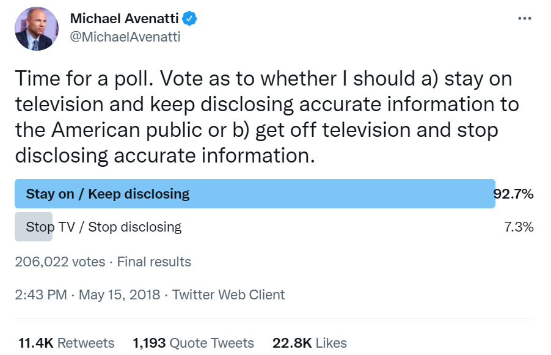
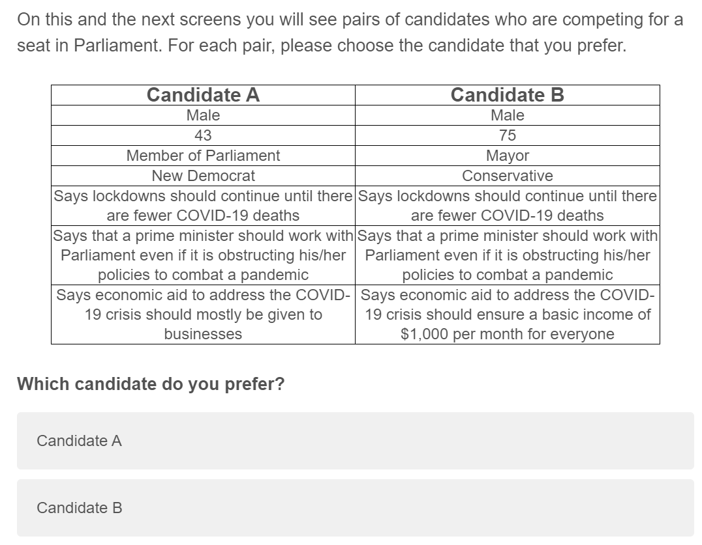
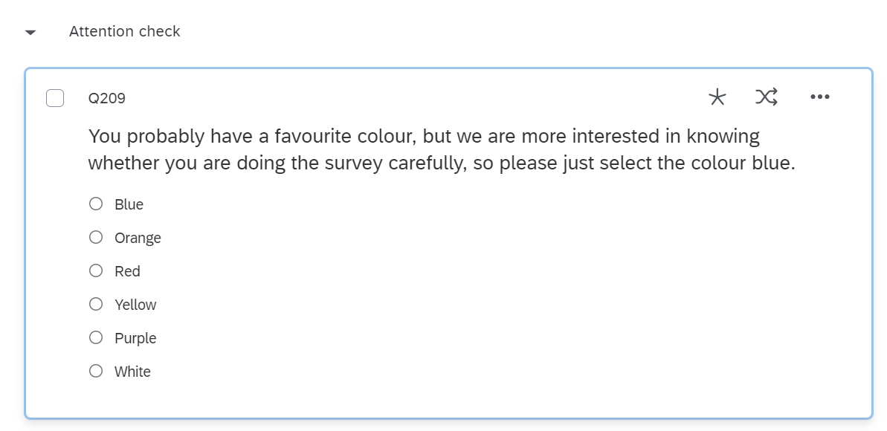
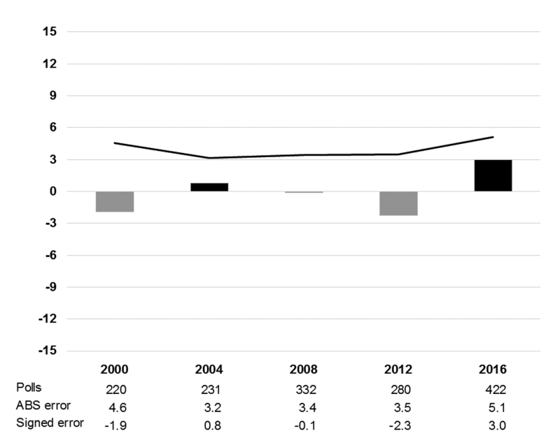
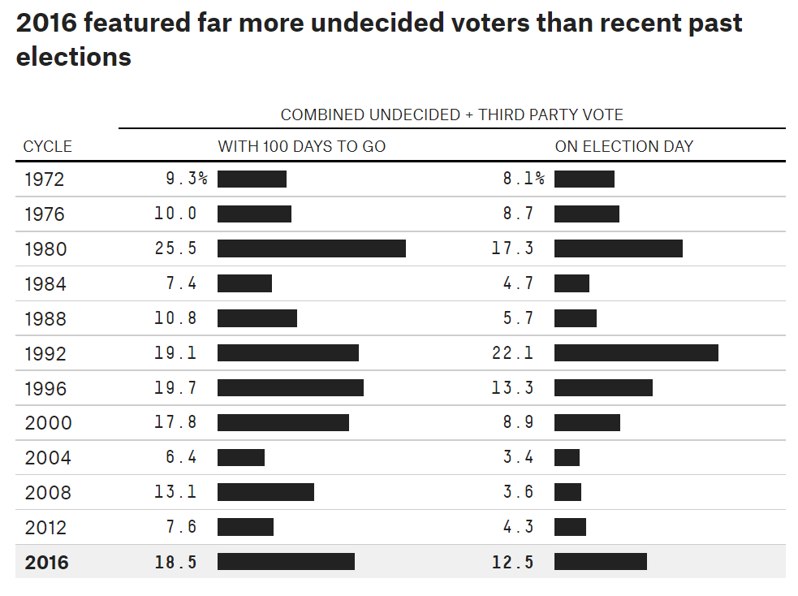

```{r setup, include=FALSE}
knitr::opts_knit$set(root.dir = rprojroot::find_rstudio_root_file())
```

## Boring admin stuff

- Thanks for completing mid-term survey; my takeaways...
  - Readings are not helpful
    - Textbook readings or other readings? (POLLING)
  - In-person labs are too fast-paced 
    - I've talked to the TAs about this
  - Assignment instructions are sometimes unclear
  - Disconnect between classes and labs
- Quiz 1: out now!
  - You have until Wednesday 11:59PM

## What you think of your learning

\tiny

```{r, message=FALSE,warning=FALSE, out.height='60%',fig.height=6,fig.width=11}
library(ggplot2)
library(tidyverse)
midcourse <- read.csv("midcourse.csv") %>% slice(-1:-2) %>% 
  mutate(effective = factor(
    Q4, levels = c("Not effective at all", "Slightly effective",
                   "Moderately effective", "Very effective", "Extremely effective")))
ggplot(midcourse, aes(x = effective)) +
  geom_bar(fill = "steel blue", colour = "black") +
  scale_x_discrete(drop = FALSE) +
  theme_bw(base_size = 19)
```

## What you think of the workload
\tiny

```{r, message=FALSE,warning=FALSE, out.height='60%',fig.height=6,fig.width=11}
midcourse %>% 
  mutate(workload = factor(
    Q9, levels = c("Light", "Moderate", "Heavy but manageable", "Heavy and unmanageable"))) %>% 
ggplot(aes(x = workload)) +
  geom_bar(fill = "steel blue", colour = "black") +
  scale_x_discrete(drop = FALSE) +
  theme_bw(base_size = 19)
```
  
  
## Issues in survey design

Let's assume that your sampling is unassailable: 

- Your sampling frame is a perfect representation of the population
- You randomly draw a large-enough sample from this sampling frame
- Everyone who is contacted agrees to answer

Things can still go wrong! 3 areas of concern:

- Question wording
- Inattentiveness
- Social desirability bias

## Question wording 

How we phrase our questions matter

- Wordings that appear similar to us may elicit different responses
- An example we've seen: climate change vs global warming
  - Global warming: 44% of Republicans agree has been happening
  - Climate change: 60% of Republicans agree has been happening^[See Schuldt, Konrath, and Schwarz [@schuldt_global_2011]]
  - In both cases, we're trying to measure the same underlying concept
- We want **unambiguous and simple** question wording

## Question wording problems

"Should third-party advertising be allowed during the federal elections?"

\pause

  - The language may be unfamiliar to respondents -- what's "third-party advertising"? 
  - Solution: use simpler language or provide short introduction 
  - For instance: "Should political advertising by unions and corporations be allowed during the federal elections?"

"Did you vote in the last election?"

\pause

- The wording of the statement is vague 
- Federal election? Provincial election? Municipal election? 

## Question wording problems

{width='75%'}

\pause

Double-barelled question

- The question has multiple components
- What if I want him to get off television, but continue disclosing information? 

## Question wording problems

"Do you agree that the use of recreational marijuana should be legalized?"

- Leading question: encourages respondents to agree
- Simple fix: "Do you agree *or disagree*..."

## Question wording problems

"Since the beginning of last year -- that is since January of 2020 -- have you attended a formal or informal meeting organized by yourself, by someone else you know personally, or by a religious, social, civic, governmental or political group to specifically discuss a local, provincial, national, or international issue -- for example, neighbourhood crime, housing, schools, social security, electoral reform, global warming, or any other public issue that affects people?"

\pause 

SO WORDY!!

- Your respondents are *not* going to read the full question
- Online survey: +/- 20 words 
- Face-to-face or phone: a single breath 
- Potential trade-off between providing context and increasing inattentiveness 

## Question wording: the tradeoff

- Some issues are complex and hard to summarize briefly
- One approach: leave the wording as simple as possible
  - "Would you support or oppose changing zoning laws to allow for the construction of multi-family homes?"
  - But what do people know about zoning policy? 
  - People will probably answer nonetheless $\leadsto$ non-attitudes 
- Another approach: provide contextual information 
\footnotesize
- "When building new housing, any new construction must follow zoning laws which outline what kind of buildings can be built where. Some are now calling for changes to the zoning laws where they live to allow for the construction of multi-family homes. Supporters of this say that this will drive economic growth as more people will be able to move to high-opportunity regions with good jobs and will allow more Americans the opportunity to get affordable housing of their own, making it easier to start families. Opponents of this say that single-family zoning requirements are important to protect the distinct character of their neighborhoods. They also cite concerns that development could have negative impacts on the environment. Would you support or oppose changing zoning laws to allow for the construction of multi-family homes?"

## Inattentiveness 

A growing problem with online surveys

- In-person and phone: easy to tell if respondent is "satisficing" 
  - "Satisficing": using shortcuts that speed up survey duration
- Online: hard to know exactly what respondents are doing
  - They may not read the question at all
  - Read it very quickly and miss important detail
    - Think again of climate change vs global warming...
  - Walk away from the survey and come back to it hours later
- I'll show you an example from my own research!

## Inattentiveness in our conjoint experiment

{height='80%'}

## Inattentiveness in our conjoint experiment

\scriptsize

```{r,message=FALSE,out.height='60%',fig.height=6,fig.width=11}
library(ggplot2)
load("C:/Users/olivi/Documents/Grad/McGill Fall 2021/POLI210/lectures/lecture_9.1/conjoint.RData")
ggplot(conjoint, aes(x = time_conjoint1)) +
  geom_histogram(fill = "steel blue", col = "black") +
  geom_vline(xintercept = mean(conjoint$time_conjoint1), col = "red", linetype = "dashed") +
  theme_bw(base_size = 19)
```

## Inattentiveness in our conjoint experiment

\scriptsize

```{r,message=FALSE,out.height='80%',fig.height=6,fig.width=8}
boxplot(conjoint$time_conjoint1)
```

## Inattentiveness: the fix

To deal with inattentiveness, survey design matters a lot

- Too long $\leadsto$ respondents tune out
- Too repetitive $\leadsto$ respondents tune out
- The questions are too complex $\leadsto$ respondents tune out

Otherwise, **attention checks**

{height='90%'}

## Attention checks in our survey

\scriptsize

```{r,out.height='55%', fig.height=6,fig.width=9}
table(conjoint$attn_check)

ggplot(data = conjoint, aes(x = attn_check, y = time_conjoint1)) +
  geom_boxplot(fill = "hotpink3") +
  theme_bw(base_size = 19)
```

## Social desirability bias

Respondents may not give truthful answers because they think of their answer as socially undesirable

- Often related to behavior/attitudes that are thought of as reprehensible
- e.g. support for violence; prejudice towards groups; illegal behavior
- Your respondents will still answer; but their answers will not be truthful
- Your estimate of the "undesirable" behavior/attitude will be **biased downward**

On the contrary, people may lean toward answers that they think are socially desirable

- e.g. turnout; self-reports of volunteering
- Here, your estimate will be **biased upward**

## Social desirability 

::: columns

:::: column

![Turnout in British Election Study [@prosser_twilight_2018]](bes_turnout.png){height='80%'}

::::

:::: column

The British Election Study systematically overestimates turnout 

- One cause: social desirability bias
- Another cause: sampling bias! 
  - The sorts of people who took the survey are more interested in politics 

::::

:::

# The state of political polling
  
## Are polls getting worse? 

Do you think election polls have been getting worse? (POLLING)
\pause

![Absolute polling error across time in 45 countries, 1942-2017 [@jennings_election_2018]](polling_error_jennings.png){width='80%'}

Polling error for party $i$: $|Poll_i - Election_i|$

## Are American polls getting worse? 

![Polling error in presidential elections, 1936-2016 [@kennedy_evaluation_2018]](polling_error_kennedy.png){width='80%'}

## What hapened in 2016?

If things haven't been getting worse, what explains polling misses? 

- 2016 US election, Brexit...

2016 US election: national-level polls were okay

- But *state*-level polls were historically bad
- And because of the Electoral College, the state polls matter a lot!

{width='50%'}

## Potential explanations for 2016

2016 US election: some hypotheses [@kennedy_evaluation_2018]

- Nonresponse bias and deficient weighting 
- Late deciders
- Misspecified likely voter models
- The "shy" Trump voters 

Keep in mind: highly-paid experts fall prey to these issues!

## Problem #1: Nonresponse bias and deficient weighting

Nonresponse bias: the people who decline to be interviewed are systematically different

- Solution: give greater weight to respondents from underrepresented groups

\scriptsize

```{r,echo=FALSE,message=FALSE,warning=FALSE}
library(dplyr)
library(knitr)
library(kableExtra)
tribble(~`Unit`, ~`Female`, ~`Education`, ~`Height`,
        "1", "1", "College", "4ft, 3in",
        "2", "1", "Doctorate", "3ft 7in",
        "3", "0", "High school", "4ft, 8in",
        "4", "1", "Doctorate", "5ft, 3in",
        "5", "1", "Doctorate", "4ft, 4in") %>% 
kbl(booktabs = TRUE) %>% 
  kable_styling(latex_options = "striped")
```

\normalsize

Is my sample representative? \pause

- Well, depends what **population** we are interested in
- Maybe I'm interested in attitudes among highly-educated dwarves!

## Problem #1: Nonresponse bias and deficient weighting

\scriptsize

```{r,echo=FALSE,message=FALSE,warning=FALSE}
library(dplyr)
library(knitr)
library(kableExtra)
tribble(~`Unit`, ~`Female`, ~`Education`, ~`Height`,
        "1", "1", "College", "4ft, 3in",
        "2", "1", "Doctorate", "3ft 7in",
        "3", "0", "High school", "4ft, 8in",
        "4", "1", "Doctorate", "5ft, 3in",
        "5", "1", "Doctorate", "4ft, 4in") %>% 
kbl(booktabs = TRUE) %>% 
  kable_styling(latex_options = "striped")
```

\normalsize

But I'm probably not interested in dwarves

- The Canadian population:
  - About 50% female
  - Typical person has high school/college diploma
  - Mean height is probably about 5ft, 6in? 
- In my sample, women, the highly-educated, and short people are overrepresented because more likely to agree to participate 
- One fix: weights

## Problem #1: Nonresponse bias and deficient weighting

\scriptsize

```{r,echo=FALSE,message=FALSE,warning=FALSE}
library(dplyr)
library(knitr)
library(kableExtra)
tribble(~`Unit`, ~`Female`, ~`Education`, ~`Height`, ~`Weight`,
        "1", "1", "College", "4ft, 3in", "1",
        "2", "1", "Doctorate", "3ft 7in", "1",
        "3", "0", "High school", "4ft, 8in", "1",
        "4", "1", "Doctorate", "5ft, 3in", "1",
        "5", "1", "Doctorate", "4ft, 4in", "1") %>% 
  kbl(booktabs = TRUE) %>% 
  kable_styling(latex_options = "striped") %>% 
  column_spec(column = 5, col = "red")
```

\normalsize 

By default, everyone is weighted equally

- You can think of this as everyone having a weight of 1

To overcome nonresponse bias, I can:

- Give more weight to units whose characteristics are underrepresented (weight > 1)
- Give less weight to units whose characteristics are overrepresented (weight < 1)

Who should we weigh more in our sample? 

## Problem #1: Nonresponse bias and deficient weighting

\scriptsize

```{r,echo=FALSE,message=FALSE,warning=FALSE}
library(dplyr)
library(knitr)
library(kableExtra)
tribble(~`Unit`, ~`Female`, ~`Education`, ~`Height`, ~`Weight`,
        "1", "1", "College", "4ft, 3in", "?",
        "2", "1", "Doctorate", "3ft 7in", "?",
        "3", "0", "High school", "4ft, 8in", "?",
        "4", "1", "Doctorate", "5ft, 3in", "?",
        "5", "1", "Doctorate", "4ft, 4in", "?") %>% 
kbl(booktabs = TRUE) %>% 
  kable_styling(latex_options = "striped") %>% 
  column_spec(column = 5, col = "red")
```

\normalsize 

Who should be given more weight? 

\pause
- Unit 3 for sure! Males and low-education are underrepresented
- Maybe unit 1? College-educated are underrepresented

\pause 

Which variables you weigh on is crucial

- You can't possibly weigh on everything 
- You want to weigh on the variables that are most correlated with the outcome of interest

## Problem #1: Nonresponse bias and deficient weighting

So what was the problem in 2016? 

- Pollsters would weigh on gender, age, ethnicity, etc. 
- But not on education! Why? 
  - Education *used to* have a curvilinear relationship with vote choice
  - The (undersampled) poorly-educated: voted Democrat
  - The (oversampled) well-educated: voted Democrat
  
![Democratic margin by education level in key states, 2012 and 2016 [@jennings_election_2018]](education_weighting.png){height='50%'}

## Problem #1: Nonresponse bias and deficient weighting

](education_weighting2.png){height='80%'}

## Problem #2: late deciders

The closer the poll to the election, the more accurate it tends to be

- People who don't know who to vote for may disproportionately break for one candidate
- Polls can miss these "late deciders"
- At the extreme, someone who decides *in the voting booth*

{height='55%'}

## Problem #3: misspecified likely voter models

Not everyone who is polled ends up voting

- I don't want to include people who I think won't vote
  - (if the goal is to predict the election's outcome)
- Using statistical methods that we'll learn about, you can look at a variety of variables...
  - Age, education, political interest...
- And produce a "guess" of whether any given person will vote or not
- This "model" of voter turnout is built using past data
  - e.g. Using data from the most recent Canadian election, I can predict that someone with a college degree is X percentage points more likely to vote than a person with a high school diploma
- My model fits the data *from the last election*
  - But what if the relationship between different IVs (education, income, age...) and turnout changes? 
- **Misspecified**: your model does a poor job of predicting who will vote!
  
## Problem #3: misspecified likely voter models

Gallup's surprisingly simple likely voter model: 7 questions

1. Thought given to election (quite a lot, some)
2. Know where people in neighborhood go to vote (yes)
3. Voted in election precinct before (yes)
4. How often vote (always, nearly always)
5. Plan to vote in 2012 election (yes)
6. Likelihood of voting on a 10-point scale (7-10)
7. Voted in last presidential election (yes)

Score 6 or 7: classified as a "likely voter" 

[See here for more info](https://news.gallup.com/poll/111268/how-gallups-likely-voter-models-work.aspx)

## Problem #4: "shy" Trump voters

One hypothesis: some people prefer not to declare support for Trump

- Remember "testable implications"?
- If the hypothesis above is correct, what would we expect to see in the data?
- Kennedy et al. [-@kennedy_evaluation_2018] point to 2 testable implications:
  - Differences in Trump support by mode
    - Telephone interview: $\uparrow$ pressure to self-censor
    - (How do we test this? An experiment!)
  - Trump should outperform polls more than other Republicans
    - Other Republicans: $\downarrow$ pressure to self-censor
- Findings: very little evidence of the "shy" Trump voter

## References {.allowframebreaks}

\footnotesize